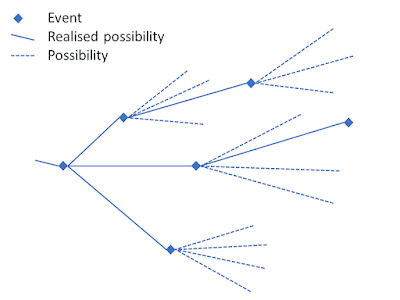

# The Quantum Mechanics of Events, Histories and Trees {#sec-Events_Histories_and_Trees}

## *Gemini feedback*
## 1. Foundations vs. Interpretation (Credo 1 & 2)

Your alignment here is crucial. Fröhlich’s insistence on "completing the foundations" rather than adding a loose philosophical gloss ("interpretation") matches your goal of a generalized probability theory.

By demanding a **"structure-preserving map"** between mathematical symbols and concrete physical phenomena, Fröhlich is advocating for a strict mathematical realism. In your framework, this means that the complex of probability spaces cannot just be a computational trick; it must structurally map directly to how physical possibilities manifest.

---

## 2. The Ontological Friction: What Constitutes "What Is"? (Credo 3)

Your critique of paragraph (3) hits on a fundamental divide in modern quantum foundations: **Event/Process Ontology vs. Substance/State Ontology.**

* **Fröhlich’s View (Event-Ontology):** For the ETH school, the ultimate building blocks of reality are *events* and the *histories* they form. Objects like electrons, protons, or fields are secondary; they are essentially the structural rules or "bonds" that constrain which histories are possible. Reality is a verb, not a noun.
* **Your View (Substance/State-Ontology):** You argue that events cannot exist in a vacuum—there must be *things* (particles, fields, physical quantities) to which things happen. The atoms, fields, and their possible states must be granted ontological status.

### Bridging the Gap

To reconcile this for your upcoming posts, consider this perspective: **Can your physical quantities be defined by the structure of the probability spaces themselves?** If an atom is "real," its reality in an event-based framework might be represented by a invariant structural feature of the complex of probability spaces. The "thing" is the persistent topology of possibilities, while the "event" is the actualization of a point within that topology.

---

## 3. Mathematical Rigor as an Epistemic Guardrail (Credo 4 & 5)

Your defense of mathematical rigor against the "rigor for rigor's sake" critique is vital. As you noted, Feynman warned us about fooling ourselves; mathematical rigor is the ultimate tool for exposing implicit, lazy assumptions.

In quantum mechanics, loose mathematics often hides the measurement problem behind vague terms like "environment" or "decoherence" without specifying *when* or *how* a definite outcome actually emerges. Fröhlich uses rigorous operator algebra (von Neumann algebras, specifically type $III_1$ factors in relativistic settings) to force the mathematics to tell us exactly when a possibility becomes an event.

---

## Moving Forward: The Horizon of ETH

The six topics you listed at the end are the core battlegrounds of quantum foundations. As you dive into them, keep these specific questions in mind for your generalized probability theory:

* **On Loss of Predictability:** How does Fröhlich’s view of the future branching into trees match your network of probability spaces?
* **On Locality:** Does your complex of probability spaces naturally prevent faster-than-light signaling while maintaining quantum non-locality?
* **On the Nature of Events:** In ETH, an event occurs when a mathematical condition called the **"Information Loss Constraint"** is met. You will want to look at how this constraint can be translated into a property of your probability spaces.

Your approach of using ETH to patch the gaps in your own theory is an excellent methodology. It ensures you aren't building in a vacuum, but rather testing your generalized probability theory against one of the most mathematically rigorous frameworks available today.

Which of the six topics from Fröhlich's list do you plan to tackle first in your next post?

It sounds like you are laying the groundwork for a deeply rigorous and conceptually clean exploration of the **ETH Approach (Events, Trees, and Histories)**. Bridging your own work—where the quantum state is a complex of probability spaces—with Fröhlich’s framework is an excellent conceptual exercise.

Let's break down your reflections on Fröhlich’s "credo," particularly the areas of alignment and the friction point regarding ontology.

## End of feedback

---

It is time to return to quantum mechanics. The approach I have been developing is a generalised probability theory were the quantum state sits on a complex of probability spaces. In my review post of October 2022 I referred to the work of Fröhlich and colleagues and their search for a fundamental theory of quantum mechanics. They call it ETH (Events, Trees, and Histories) [@frohlich2021relativistic]. Theirs is also an approach that proposes that quantum mechanics is fundamentally probabilistic and that it describes events and not just measurements. So, I will, over several posts, work through their theory to learn how some of the gaps in my own approach may be addressed. The picture below gives an early indiction how the concept of possibilities fit into the ETH scheme. An event is identified with the realisation of a possibility.

It has been a theme of my posts to try and clarify the philosophical fundamentals, especially ontology, associated with a physical theory. So, I will start the review of ETH with the introduction to a paper in which Fröhlich sets out his "credo" for his endeavour [@frohlich2021relativistic]. His credo is:

::: {.callout-important title="Fröhlich's Credo"}
1. Talking of the “interpretation” of a physical theory presupposes implicitly that the theory has reached its final form, but that it is not completely clear, yet, what it tells us about natural phenomena. Otherwise, we had better speak of the “foundations” of the theory. Quantum Mechanics has apparently not reached its final form, yet. Thus, it is not really just a matter of interpreting it, but of completing its foundations.
2. The only form of “interpretation” of a physical theory that I find legitimate and useful is to delineate approximately the ensemble of natural phenomena the theory is supposed to describe and to construct something resembling a “structure-preserving map” from a subset of mathematical symbols used in the theory that are supposed to represent physical quantities to concrete physical objects and phenomena (or events) to be described by the theory. Once these items are clarified the theory is supposed to provide its own “interpretation”. (A good example is Maxwell’s electrodynamics, augmented by the special theory of relativity.)
3. The ontology a physical theory is supposed to capture lies in sequences of events, sometimes called “histories”, which form the objects of series of observations extending over possibly long stretches of time and which the theory is supposed to describe.
4. In discussing a physical theory and mathematical challenges it raises it is useful to introduce clear concepts and basic principles to start from and then use precise and – if necessary – quite sophisticated mathematical tools to formulate the theory and to cope with those challenges.
5. To emphasize this last point very explicitly, I am against denigrating mathematical precision and ignoring or neglecting precise mathematical tools in the search for physical theories and in attempts to understand them, derive consequences from them and apply them to solve concrete problems.
:::

where I have added the numbering for easy reference. Let's take them one by one.

I agree completely with this comment although I may have lapsed occasionally into using the term "interpretation" loosely. So, a possibility to be investigated is that in addition to the standard formulation of quantum mechanics there may be an additional stochastic process that describes event histories.

The use of "interpreted" in the second paragraph has to do with the scope and meaning of the theory. We have the physical quantities that are to be described or explained, their mathematical representation and then the various theoretical structures that can make use of these quantities in their mathematical representation. In this way it should be clear from the outset what the intended theory is about. It about things and their mathematical representation.

This statement poses more of a problem. For me, the ontology has more to do with the concerns in the previous paragraph.  While I agree that there are events, there must be physical quantities that participate in these events. These quantities must also form part of the ontology. For example, atoms may be made up of more fundamental particles. The atoms and the more fundamental particle are part of the ontology, and it is part of the structure of the ontology that atoms are made up of electrons, protons, and neutrons. Neutrons and protons are made up of still more fundamental particles. I would also include fields and possible states of the physical objects in the ontology.

Again, I agree. Feynman is known to have said that doing science is to stop us fooling ourselves. He was thinking primarily of comparing predictions with the outcome of experiments. However, mathematics also plays this role. By formulating rigorously the mathematics of a theory and following strictly the consequences we can avoid introducing implicit assumptions that make thing work out "all right" when they should not. When we get disagreement with experiment then we can be sure that it is the initial assumptions about objects or their mathematical representation that is at fault.

Frölich's reputation is as an especially rigorous mathematical physicist and not only philosophers, but many physicists take such a rigorous approach to the mathematics to be rigour for rigour's sake. While I do not claim his skills, I am more than happy to try ans learn form an approach that emphasises precise mathematics.

Within this "credo" Fröhlich and collaborators address:

* Why it is fundamentally impossible to use a physical theory to predict the future.
* Why quantum mechanics is probabilistic.
* The clarification of "locality" and "causality" in quantum mechanics.
* The nature of events.
* The evolution of states in space-time.
* The nature of space-time in quantum mechanics.

We will work our way through these topics in upcoming posts.
