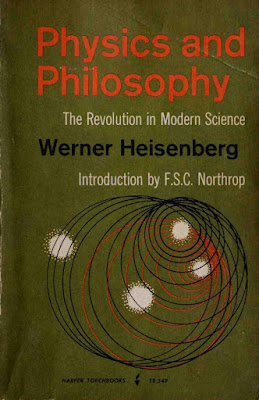
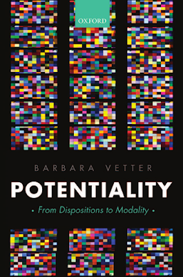

# Heisenberg, Potentiality, and Quantum Ontology {#sec-Heisenberg_Potentiality_and_Quantum_Ontology}

Heisenberg, in one of his excursions into philosophy, *Physics and Philosophy*, [@heisenberg1958physics], discusses epistemology, logic, and ontology. In developing his ideas on how the innovations of quantum mechanics impact philosophy, he introduces (or rather reintroduces, with reference to Aristotle) the concepts of **potentiality**.

He comes to potentiality through considering the logic required to refer to things that quantum mechanics describes. That is, it

> “… concerns the ontology that underlies the modified logical patterns. If the pair of complex numbers represents a ‘statement’ in the sense just described, there should exist a ‘state’ or a ‘situation’ in nature in which the statement is correct. We will use the word ‘state’ in this connection. The ‘states’ corresponding to complementary statements are then called ‘coexistent states’ by Weizsäcker. This term ‘coexistent’ describes the situation correctly; it would in fact be difficult to call them ‘different states,’ since every state contains to some extent also the other ‘coexistent states.’ This concept of ‘state’ would then form a first definition concerning the ontology of quantum theory. One sees at once that this use of the word ‘state,’ especially the term ‘coexistent state,’ is so different from the usual materialistic ontology that one may doubt whether one is using a convenient terminology. On the other hand, if one considers the word ‘state’ as describing some potentiality rather than a reality—one may even simply replace the term ‘state’ by the term ‘potentiality’—then the concept of ‘coexistent potentialities’ is quite plausible, since one potentiality may involve or overlap other potentialities.”

In the version of quantum mechanics that I have been developing, these *coexistent potentialities* should be understood in relation to the $\sigma$‑complex. Despite his hints, Heisenberg does not succeed in including potentiality in the required logic. What is needed is a **modal logic** that includes a **POTENTIALITY operator**. Barbara Vetter constructs such a modal logic and defends it with modal metaphysical arguments in her book *Potentiality: From Dispositions to Modality* [@vetter2015].

There is a need for a theory going beyond the naïve position that there are objects that simply have the potential to have certain properties. In quantum mechanics in particular it is not sufficient to say that an electron has the potential to be in some place. If this is elaborated to saying that it has some position with a certain probability, we get a deceptive oversimplification. The theory of potentiality developed by Vetter gives potentialities the status of **properties of objects**. Contrary to Heisenberg’s view that “one considers the word ‘state’ as describing some potentiality rather than a reality,” Vetter’s theory allows us to enlarge the domain of what is real to include potentialities.

## Possibility and Iterated Potentiality

In standard quantum mechanics, observables can take possible values. The possibility is described by the theory, and the values are represented by the spectrum of the self‑adjoint operator that represents the observable.

Vetter proposes, in general, to define possibility as follows:

> **POSSIBILITY:**  
> *It is possible that* $p$ $=_{\mathrm{df}}$ *Something has an iterated potentiality for it to be the case that* $p$.

We have now moved on to potentiality and, more generally, its **iteration**. I have discussed dispositions in previous posts and now explore Vetter’s proposal that we call those properties which form the metaphysical background for disposition ascriptions **potentialities**. In the definition, the *something* also needs explanation. Something can be an object or any collection of objects.

Potentialities are individuated not by a pair of stimulus and manifestation and a corresponding conditional, but by their **manifestation alone**. The manifestation of a potentiality is the property that the potentiality’s possessor would have if the potentiality were to be manifested. A manifestation can be a property of an object (or collection of objects) or a relation that the object (or collection) has with something else.

## Joint Potentiality

The relation between a potentiality and its manifestation—the relation “... is a potentiality to ...”—allows a classification of joint potentialities:

- **Type 1 joint potentialities**: the manifestation is a relation between, or a plural property of, *all* its possessors.
- **Type 2 joint potentialities**: the manifestation consists in a property or relation of *only some*, but not all, of its possessors.

Examples of Type 1 include the door key’s joint potentiality with the door for the former to unlock the latter.

Examples of Type 2 include:

- a uranium pile (with a potential to go unstable) plus the rods and fail‑safe mechanism  
- a glass (with a potential to break) but protected by styrofoam  
- a city (with a potential to be destroyed) and its defence system  

In all three, only one of the objects manifests the disposition or potentiality, but they jointly have the potentiality to a certain degree.

## Extrinsic Potentiality

An object has an **extrinsic potentiality** if it has a joint potentiality whose co‑possessors are the *dependees* of the extrinsic potentiality. In the key–door example, the door is part of the manifestation (unlocking the door). In general, where a potentiality’s manifestation consists in a relation to a particular other object—such as opening *this* particular door—the potentiality will be extrinsic.

## Iterated Potentiality

Potentialities themselves are properties. So objects can have:

- potentialities to have potentialities  
- potentialities to have potentialities to have potentialities  
- and so on, indefinitely.

These are **iterated potentialities**.

## Formalising Potentiality

In Vetter’s theory, potentialities include dispositions and abilities as properties of individual objects or collections of objects. POTENTIALITY cannot be defined, because it is metaphysically fundamental, but it can be **formalised**.

Just as modal operators act on propositions, the modal potentiality operator is:

$$
\mathrm{POT}
$$

POT is a **predicate‑forming operator**. Where $\Phi$ is a predicate:

$$
\mathrm{POT}[\Phi](t)
$$

ascribes to $t$ the potentiality to $\Phi$.

To allow POT to operate on sentences, we introduce the $\lambda$‑operator:

$$
\mathrm{POT}[\Phi](t) \rightarrow \mathrm{POT}[\lambda x.\,\phi](t)
$$

where $\lambda x.\phi$ means “is such that $\phi$”.

A simple iterated potentiality is:

$$
\mathrm{POT}[\lambda x.\,\mathrm{POT}[F](x)](a)
$$

which ascribes to $a$ the potentiality to have the potentiality to be $F$.

## The Electron

The electron, as described by quantum mechanics, demonstrates the ontological strangeness of quantum objects:

- it has the potential to be somewhere  
- to have a momentum  
- to have charge and mass  

But quantum mechanics gives more structure: the electron appears somewhere with a **probability**, and these probability models are combined in a **$\sigma$‑complex**, corresponding (possibly) to Weizsäcker’s “coexistent states”.

The electron has a **joint potentiality** with other objects to manifest one of the probability distributions from the complex. That probability distribution weights the appearance of specific values of the property with a numerical probability.

In an experiment the electron does not appear directly but only through observable effects on the objects with which it is in a relationship. The electron never appears in the way that a macroscopic object (such as a book) appears, with phonomonological directness. The electron is never in space-time but it does influence other objects that are in space-time to show the effects of its presence as a potentiality.  

Thus:

- the probability that the electron appears in a region of space  
- in certain circumstances **and** on in relation to other objects. 

is itself an **iterated potentiality**.

This example indicates how the concept of potentiality, as formalised, can be used to describe quantum processes. It remains to be seen how useful this will be when we introduce considerations of spin, entanglement, interference, etc. This will be explored in further chapters.
