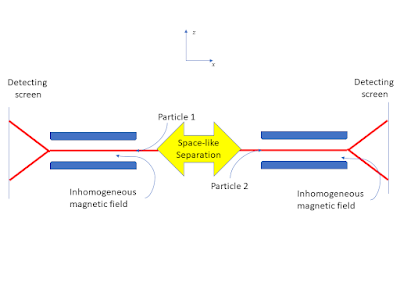

# Locality, Microcausality, and Entanglement {#sec-Locality_and_quantum_mechanics}

Until now, the discussion has tried, as far as possible, to free quantum mechanics from reference to measurement but quantum mechanics also has a problem with locality.  First of all it is worth remembering that classical mechanics also had a locality problem and it was tolerated for two centuries. Newton's theory of gravity was published in 1687 and structurally similar Coulomb's law of electric charge attraction and repulsion was published in 1785. In both cases any local change in mass or charge, whether magnitude or position, had an instantaneous effect everywhere. There was no mechanism in the physics for propagation of the effect of a change on mass (gravity) or charge (electricity). A local change had an effect across the universe. The solution to this was found first for electricity in combination with magnetism. Faraday proposed the existence of a field. The mathematical formulation of this concept by Maxwell led to the classical electromagnetic theory (1865) and provided a propagation mechanism. 

The success of electromagnetic theory brought to the fore the locality problem with classical dynamics. The space and time translation invariance in classical Newtonian dynamics did not follow the same transformation rules as in the electromagnetic theory and there was still no mechanism proposed for the propagation of gravitational effect. As is well known, Einstein, inspired by Maxwell, solved both anomalies with first the special theory , which indicated that causal effects can not propagate faster than the speed of light in empty space. Then the general theory of relativity provided a propagation mechanism by making space-time an active physical entity supporting gravitational interaction and waves.

By the time the general theory of relativity was formulated it was evident that classical physical theory had a further deep problem; it could not explain atomic and other micro phenomena. To tackle this problem solutions were found for specific situations. Max Plank introduce his constant $\hbar$ to resolve the problem of the ultraviolet singularity in the black body radiation spectrum by proposing energy quantisation [@bohm1951]. This same constant came to be fundamental in explaining atomic energy levels, the photoelectric effect role and more generally the quantisation of action.

Quantum theory took shape is the 1920's with the rival formations, by Heisenberg and Schrödinger (with much help from others), shown to be formally equivalent in terms of experimental consequences. The space time translation symmetry of special relativity was also built into an equation for the electron proposed by Dirac that in turn implied the existence of anti-matter. But a fully relativistic quantum mechanics remains a research topic [@haag1996]. 

To combine particle theory with electromagnetism quantum electrodynamics was developed. This theory was remarkably successful in its empirical confirmation but relied on some dubious mathematical manipulations. To deal with this the mathematical foundations of quantum field theory were examined. It is at this point that the first type of locality that we are going to consider appears in quantum theory in mathematically precise form [@haag1996].

## Causal Locality {#sec-causal-locality}

A basic characteristic of physics in the context of special relativity and general relativity is that causal influences on a Lorentzian manifold spacetime propagate in timelike or light-like directions but not space-like. Space-like separated points in space-time lie outside each other's light cone, which means that no influence can pass from one to the other. 

A further way of considering causality is that influences only propagate into the future in time-like and light-like directions, but this is not simple to dealt with in either classical special relativity or standard quantum mechanics because of their time reversal symmetry. One approach would be to treat irreversible processes through coarse-grained entropy in statistical physics. But this seems more like a mathematical trick that treats irreversibility as due to a lack of access to the detailed microscopic reversable dynamics. That is, irreversability is an illusion. A more fundamental approach is to develop a new physics, as is being attempted by @frohlich2021relativistic and here in this book.

To return to Einstein causality, any two space-like-separated regions of spacetime should behave like independent subsystems. This causal locality is, with a slightly stronger technical definition, Einstein causality. This concept of locality when adopted in relativistic quantum theory (algebraic theory) implies that space-like separated local self-adjoint operators commute. This is sometimes known as microcausality. Microcausality is causal locality at the atomic level and below.

In quantum theory, where operators represent physical quantities, the microcausality condition requires that any operators commute that pertain to two points of space-time if these points cannot be linked by light propagation. This commutation means, as in standard quantum mechanics, that the physical quantities to which these operators correspond can be precisely determined locally, independently, and simultaneously. However, the operators in standard quantum theories and the non-relativistic alternatives discussed so far in this book don't have a natural definition of an operator that is local in space-time. For example, the position operator is not at any point in space. The points in space are held as potential values in the quantum state that is represented mathematically by the density matrix. How these potential values become actual is dealt with in standard quantum mechanics by the Born criterion, which is, however, tied to measurement situations. To remove this dependence on measurement situations is a major aim of this book and we will see that measurement only need be invoked when discussing how various form of locality and non-locality are known about.

As the introduction of classical fields cured Newtonian dynamics of action at a distance and eventually modified then replaced Newton's theory of gravity with General Relativity, the development of quantum field theory could perhaps cure standard quantum mechanics of its causal locality problem. Local quantum theory as set out in the book by @haag1996 tackles this challenge. The technical details involved will be simplified here.

Although dealing with these questions coherently within non-relativistic quantum theory is not mathematically valid, it is instructuive to explore specific examples with an emphasis on physical intuition rather than mathematical rigour. Following @froehlich2023, it is natural to consider the spin of the particle to be local to that particle. Therefore, the spin operators, whether represented by Pauli matrices or by projection operators that project states associated with some subsets of the spin spectrum, can be assigned unambiguously to one particle or another. 

In a situation where two particles are prepared so that they propagated in opposite directions their local interactions with other entities will eventually be space-like separated. The spin operators of one commute with the spin operators of the other. The local interaction of one cannot then be influence by the local interaction of the other. This is a specific example of microcausality. 

But what if the preparation of the two particles entangles their quantum states? This entanglement may persist over any subsequent separation, if the particle does not first undergo any interaction with other particles or fields. 

We note that entanglement is a state property whereas microcausality is an operator property and proceed to a discussion of entanglement and its consequences in a developed version of the two-particle example.

## Entanglement and Non-Locality {#sec-entanglement-and-non-locality}

The two-particle example we have been discussing only needs the introduction of a local spin measurement mechanism for each particle for it to become the version of the Einstein Podolsky, Rosen thought experiment formulated by @bohm1951 \index{Bohm, David}. This post will follow Bohm's mathematical treatment closely but will avoid as far as possible invoking the results of measurements. Bohm's discussion follows the Copenhagen interpretation but also uses the concept of potentiality as developed by @heisenberg1958physics.

The system in this example consists of experimental setups (described below) for two atoms ($1$ and $2$) with spin $1/2$ (up/down or $\pm\hbar$). The $z$ direction spin aspect of the state of the total system consists of four basic wavefunctions:
$$| a\rangle = |+,z,1\rangle| +,z,2\rangle$$
$$| b\rangle = |-,z, 1\rangle| -,z, 2\rangle$$
$$| c\rangle = |+, z,1\rangle| -,z, 2\rangle$$
$$| d\rangle = |-,z, 1\rangle| +,z, 2\rangle$$
it will be shown below that although the choice of the $z$ direction is convenient the results of the analysis do not depend on it.

If the total system is prepared in a zero-spin state, then it can be represented by the linear combination:

$$| 0\rangle = |c\rangle - |d\rangle \tag{1}$$

This correlation of the spin states of the particles is an example of quantum entanglement. 

Each particle also has associated with its spin state a wavefunction that describes its motion and position. Theses space wavefunctions will not be shown explicitly here but are important conceptually because the particles aways move away from each other. The description of the thought experiment is completed by each particle undergoing a Stern-Gerlach experimental interaction at space-like separated regions of space-time, as shown below.

The detecting screen is a part of an experimental setup that is need for confirming the predictions of the theory but not the physics of the effects. Here we are primarily concerned with the interaction of the particles with the magnetic field $\mathfrak{H}$. The component of the system Hamiltonian for the interaction of the particle spin with the magnetic field is, from @bohm1951,

$$\mathcal{H}= \mu (\mathfrak{H}_0 + z_1 \mathfrak{H}'_0 )\sigma_{1,z} +\mu (\mathfrak{H}_0 + z_2 \mathfrak{H}'_0 )\sigma_{2,z}$$

where $\mu = \frac{e \hbar}{2mc}$, $\mathfrak{H}_0 = (\mathfrak{H}_z)_{z=0}$ and $\mathfrak{H}'_0 =(\frac{\partial \mathfrak{H}_z}{\partial z})_{z=0}$. $m$ and $e$ are the electron mass and charge. $c$ is the speed of light in vacuum. We also assume the magnetic fields have the same strength and spatial form in both regions but this not essential. It is also assumed that each particle interacts with its own local magnetic field at the same time. This is not a limiting assumption, but it is essential to assume that the time of the interaction is short enough for the local space-time regions to remain space-like separated.

The Schrödinger equation can now be solved for a wavefunction of the form

$$|\psi\rangle = f_c |c\rangle + f_d |d\rangle$$

with initial conditions given by equation (1). The result is, once the particles have passed through the region with non-zero magnetic field strength:

$$f_c = \frac{1}{\sqrt{2}}e^{-i \frac{\mu\mathfrak{H}'_0}{\hbar}(z_1-z_2) \Delta t}$$

and

$$f_d = - \frac{1}{\sqrt{2}}e^{i \frac{\mu\mathfrak{H}'_0}{\hbar}(z_1-z_2) \Delta t}$$

Where $\Delta t$ is the time it takes for the particles to pass through the magnetic field.

Inserting the above results into the equation for $|\psi\rangle$ gives the post interaction wavefunction:

$$|\psi\rangle=\frac{1}{\sqrt{2}}e^{-i \frac{\mu\mathfrak{H}'_0}{\hbar}(z_1-z_2) \Delta t} |c\rangle - \frac{1}{\sqrt{2}}e^{i \frac{\mu\mathfrak{H}'_0}{\hbar}(z_1-z_2) \Delta t}|d\rangle$$

Therefore, for a system prepared with total spin zero undergoing local interactions in space-like separated regions, as shown in the figure, there is equal probability for each particle to be deflected either up or down. However, because of the correlation when one is deflected up the other is deflected down. 

This may seem unsurprising because the total spin is prepared to be zero. No more surprising than taking a green card and a blue card, putting them in identical envelopes, shuffling them and then giving one to a friend to take far away. Opening the envelope you kept and seeing a green card means that the distant envelope contains a blue card. This, clearly, is not a non-local influence.

However, this is not the end of the story. As mentioned above, there is nothing special about the $z$ direction of spin. The same analysis can be carried with $x$ direction states, as follows:

$$| a'\rangle = |+, x,1\rangle| +, x,2\rangle$$
$$| b'\rangle = |-, x, 1\rangle| -, x, 2\rangle$$
$$| c'\rangle = |+, x,1\rangle| -, x, 2\rangle$$
$$| d'\rangle = |-, x, 1\rangle| +,x, 2\rangle$$

and again, the zero total spin state is:

$$| 0'\rangle = |c'\rangle - |d'\rangle \tag{2}$$

Using the standard spin state relations (valid for both particles one and two, by introducing the appropriate tags (1 or 2), see @bohm1951:

$$|+,x\rangle = \frac{1}{\sqrt{2}}(|+,z\rangle + |-,z\rangle) \quad \text{and} \quad |-,x\rangle = \frac{1}{\sqrt{2}}(|+,z\rangle - |-,z\rangle)$$

Inserting into equation (2), with some algebra, it can be shown that:

$$|0'\rangle = |0\rangle$$

Therefore, if the Stern-Gerlach setup is rotated to measure the $x$ component of spin, exactly the same analysis can be carried out as for the $z$ component giving the same anti-correlation effect. It must be stressed that we are discussing physical effects and not the results of experiments or the experimenter's knowledge of events at this point.

In general, there is no reason for the two space-like separated setups to be chosen in the same direction. If the choice is effectively random then when the direction of interaction does not coincide there will be no correlation between the outcomes but if they happen to be in the same direction, then there will be the $\pm$ anti-correlation. Locally the spin operators for the $x, y$ and $z$ do not commute. Their values are potential rather than actual and remain non-actual after the interactions. The situation is not like the classical coloured cards in envelopes example. There is no direction of spin fixed by the initial state preparation. Indeed, that would be inconsistent with a total spin zero state preparation. What the interaction does is chose a $\sigma$-algebra from the local $\sigma$-complex but the spin state of the system remains entangled.

As far as local effects are concerned, each particle behaves as expected for a spin $1/2$ particle. This is causal locality. It is only if someone gets access to a sequence of measurements from both regions (here is the only place where detection enters this description of the physics of this situation) that the anti-correlation effect can be confirmed. 

The effect depends on the preparation of the initial total system state. There is persistent correlation across any distance just as in the green and blue card example, but it is mysterious because the initial state does not hold an actual value of each spin component for each particle, unlike the actuality green and blue card example. There is no way for the one particle to be influenced by the choice of direction of measurement at the region where the other particle is, but a correlation of potentiality persists that depends on the details of the total quantum state.

It is perhaps too early to simply accept that there are non-causal, non-classical correlations of potentialities between two space-like separated regions. That would be a quantum generalisation of the blue and green card example. What the theory does predict is that the effect due to entanglement is not just epistemic but physical once potentiality is accepted as an aspect of the ontology.
