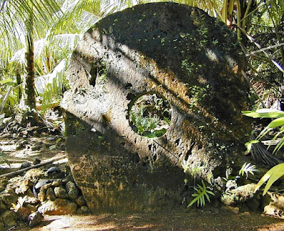

# Potentiality and Probability {#sec-potentiality-and-probability}

As outlined in the previous chapter, Barbara @vetter2015 developed the concept of potentiality in her theory of dispositional powers. In that theory, potentials are dispositions that are responsible for the manifestation of possibilities. The possibilities then tend to become actual events or states of affairs. The concept of "potential" in philosophy, in a sense close to that discussed here, goes back at least to Aristotle in *Metaphysics* Book $\Theta$. [@aristotleMetaphysics]

In contrast, probabilities are weightings summing to one that describe in what proportion the possibilities tend to appear. I propose that the potential underpins the actual appearance of the possibilities while probability shapes it. This will be discussed further in this chapter.

Barbara Vetter proposed a formal definition of possibility in terms of potentiality:

> **POSSIBILITY:** It is possible that $p =_{def}$ Something has an iterated potentiality for it to be the case that $p$.

So, it is further proposed that the probabilities are the weights that can be measured through this iteration using the frequency of appearances of each possibility. Note that this indicates how probabilities can be measured, but it is not a definition of probability.

In the field of disposition research, there is an unfortunate proliferation of terms meaning roughly the same thing. The concept of "power" brings out a disposition's causal role, but so does "potential." As technical terms in the field, both are dispositions. Now "tendency" will also be introduced, and it is often used as yet another flavor of disposition.

## Tendencies

Barbara Vetter mentions tendencies in passing in her 2015 book on potentiality and, although she discusses graded dispositions, tendencies are not a major topic in that work. In "What Tends to Be: The Philosophy of Dispositional Modality," [@anjum2018] Rani Lill Anjum and Stephen Mumford (2018) provide an examination of the relationship between dispositions and probabilities while developing a substantial theory of dispositional tendency.

In their treatment, powers are understood as disposing towards their manifestations, rather than necessitating them. This is consistent with Vetter's potentials. Tendencies are powers that do not necessitate manifestations, but nonetheless, the power will iteratively cause the possibility to be the case.

In common usage, a contingency is something that might possibly happen in the future. That is, it is a possibility. A more technical but still common view is that contingency is something that could be either true or false. This captures an aspect of possibility, but not completely because there is no role for **potentiality**; something responsible for the possibilities. There is also logical possibility in which anything that does not imply a contradiction is logically possible. This concept may be fine for logic, but in this discussion, it is possibilities that can appear in the world that are under consideration. Here, an actual possibility needs a potentiality to tend to produce it.

### Example (adapted from Anjum and Mumford)

Struck matches tend to light. Although disposed to light when struck, we all know that there is no guarantee that they will light as there are many times a struck match fails to light. But there is an iterated potentiality for it to be the case that the match lights. The lighting of a struck match is more than a mere possibility or a logical possibility. There are many mere possibilities towards which the struck match has no disposition—that is, no potential in the match towards struck matches melting, for instance.

Iterated potentiality provides the tendency for possible outcomes to show some patterns in their manifestation. In very controlled cases, the number of cases of success in iterations of match striking could provide a measure of the strength of the power that is this potentiality. This would require a collection of matches that are essentially the same.

---

## Initial Discussion of Probability

Anjum and Mumford introduce their discussion of probability through a simple example that builds on a familiar understanding of dispositional tendencies associated with fragility.

> "The fragility of a wine glass, for instance, might be understood to be a strong disposition towards breakage with as much as 0.8 probability, whereas the fragility of a car windscreen predicts its breaking to the lesser degree 0.3. Furthermore, it is open to a holder of such a theory to state that the probability of breakage can increase or decrease in the circumstances and, indeed, that the manifestation of the tendency occurs when and only when its probability reaches one."

This example is merely an introduction and needs further development, but already the claim that "the manifestation of the tendency occurs when and only when its probability reaches one" shows that it is not a model for objective probability. What is needed is a theory of dispositions that explains stable probability distributions. Of course, if the glass is broken, then the probability of it being broken is $1$. However, this has nothing to do with the dispositional tendency to break. What is needed is a systemic understanding of the relationship between the strength of a dispositional tendency and the values or, in the continuous case, shape of a probability distribution.

In the quoted example above, each power is to be understood in terms of a probability of the occurrence of a certain effect, which is given a specific value. The fragility of a wine glass, for instance, might be understood to be a strong disposition towards breakage with as much as $0.8$ probability, whereas the fragility of a car windscreen is less, and the probability of its breaking is a lesser degree $0.3$. But given a wine glass or windscreen produced to certain norms and standards, it would be expected that the disposition towards breakage would be quite stable. A glass with a different disposition would be a different glass.

Anjum and Mumford claim that, in some understandings, the manifestation of a possibility occurs when and only when its probability reaches one (see Popper, *A World of Propensities*, [@popper1990]). This is a misunderstanding of how probability works. Popper distinguished clearly between the mathematical probability measure and what he called the physical propensity, which is more like a force, but Popper does limit a propensity to have a strength of at most $1$. As I will attempt to show below, Popper, in proposing the propensity interpretation of objective probabilities, oversimplifies the relationship between dispositions and probabilities. This confusion led Humphreys to draft a paper [@humphreys1985], *The Philosophical Review*, to show that propensities cannot be probabilities. As indeed they are not. They are dispositions. That would leave open the proposition that probabilities are dispositional tendencies, but that also will turn out to be untenable.

The proposal by Anjum and Mumford that powers can **over-dispose** does seem to be sound. Over-disposing is where there is a stronger magnitude than what is minimally needed to bring about a particular possibility. This indicates that there is a difference between the notion of having a power to some degree and the probability of the power’s manifestation occurring. Among other conclusions, this also shows that the dispositional tendency does not reduce to probability, preserving its status as a potential.

Anjum and Mumford continue the discussion using "propensity" as having a tendency to some degree, where degree is non-probabilistically defined. Anjum and Mumford use the notions of "power," "disposition," and "tendency" more or less interchangeably, whereas an object may have a power to a degree, there are powers that are simply properties. In what follows, I will try to eliminate the use of "propensity," except where commenting on the usage of others, and use "tendency" to qualify either "power," "potential," or "disposition" rather than let it stand on its own.

---

## Probability vs. Necessity

A probability always takes a value within a bounded inclusive range between zero and one. If probability is $1$, then probability theory stipulates that it is "almost certain" (occurs except for a set of cases of measure zero). In contrast to what Anjum and Mumford claim, it is not natural to interpret this as necessity because there are exceptions. For cases where there are only a finite set of possibilities, then probability $1$ does mean that there are no exceptions. But as this is a special case in applied probability theory, there is no justification in equating it with logical or metaphysical necessity.

A power must be strong enough to reach the threshold to make the possibilities actual. Once the power is strong enough, then the probability distribution over the possibilities may be stable or affected by other aspects of the situation. So, instead of understanding powers and their degrees of strength as probabilistic, powers and their tendencies towards certain manifestations are the underpinning grounds of probabilities. Consider the example of tossing a coin.

A coin when tossed has the potential to fall either heads or tails. This tendency to fall either way can be made symmetric and then the coin is "fair." From which probability weightings of $1/2$ for each outcome (taking account of the tossing mechanism) can be assumed and then confirmed by measuring the proportion of outcomes on iteration. The reason why the head and the tail events are equally probable statistically, when a fair coin is tossed, is that the coin is equally disposed towards those two outcomes due to its physical constitution. The probability weightings derive, in this example, from a symmetry in the potentiality, which in turn derives from the physical composition and detailed geometry of the coin.

### The Rai Stone Example

Consider a society that uses very large stone discs as currency (e.g., [Rai stones](https://en.m.wikipedia.org/wiki/Rai_stones)). On examination of the disc, it would be possible to conjecture that if it were tossed, then there would be two possible outcomes and that those outcomes are equally likely. But this disposition is not realized because of the effort required to construct the tossing mechanism, as such a stone may weigh several metric tons. The enabling disposition that would give rise to the iteration of possibilities would have been this missing tossing mechanism. It is not a property of the disc.

The manifestation of the dispositional tendency of the disc to come to lie in one of two states needs an external mechanism that is disposed through design to toss the coin in a certain way. If the mechanism is constructed, it may be too weak. It may tend to only flip the coin once, giving a sequence such as:

$... T H T H T H H T H T H T H T H T H T H ...$

That would give a frequency of T close to $1/2$, but the sequence does not exhibit the potential for random outcomes to which the coin is disposed.

---

## Probabilities and Chance

From the above: potential and possibility are more fundamental than (or prior to) probability. Both are needed to construct and explain objective probability. The alternative, subjective probability, is based on beliefs about possibilities, but that is not the same thing as what is actually possible and how things will appear independently of anyone's beliefs or judgments.

In this investigation, I have already referred to a dispositional tendency beginning to explain objective probabilities in quantum mechanics. The term "propensity" has been used to describe these probabilities. I now think that was wrong. Propensity should be reserved for the dispositional tendency that is responsible for the probabilities to avoid this term merging the underpinning dispositional elements and probability structure. Anjum and Mumford claim that they have made a key contribution to clarifying the relationship between dispositional tendencies and probability through their analysis of **over-disposition**.

Anjum and Mumford claim "information is lost in the putative conversion of propensities to probabilities," but only if the dispositional grounding of probabilities is forgotten. Their discussion is strongly influenced by their interest in application to medical evidence where a major goal is reduction of uncertainty. Anjum and Mumford propose two rules on how dispositions and probability relate:

1. The more something disposes towards an effect $e$, the more probable is $e$, *ceteris paribus*; and the more something over-disposes $e$, the closer we approach probability $P(e) = 1$.
2. There is a nonlinear "diminishing return" in over-disposing. E.g., if over-disposing $e$ by a magnitude $x2$ produces a probability $P(e) = 0.98$, over-disposing $x3$ might increase that probability "only" to $P(e) = 0.99$, and over-disposing $x4$ "only" to $P(e) = 0.995$, and so on.

While these rules are fine as propositions, they miss the mark in explaining the relationship between dispositions and probability. In the coin tossing example, strengthening the mechanism is not about strengthening one outcome. Over-disposing does provide support for the distinction between the strength of the disposition and value of the probability, but the relationship between underpinning potentials, dispositional mechanisms, and the iterated outcomes needs to be made clear.

---

## Radioactive Decay and Quantum Theory

Anjum and Mumford also discuss coin tossing and make substantially the same points as I made above. However, having clarified the distinction between propensity and probability, they revert to using the term propensity in a way that risks confusing the concepts of dispositional tendency and probabilities with random outcomes. They say "50% propensity" rather than "50% probability." They then introduce the term "chance" that they relate to outcomes in some specified situations. Propensity is then reserved by them for potential probability while chance is the probability of an outcome in a situation. This is more confusing than helpful.

Anjum and Mumford go on to a discussion of radioactive decay that is known to be described by quantum theory. They make no mention of quantum theory (this will be corrected by them in Chapter 4) and strangely claim that radioactive decay is not probabilistic. The probability distributions derived from quantum mechanics unambiguously give the probability of decay per unit time. There are, per unit time, two possibilities: "decay" or "no decay." Their error is to claim "only one manifestation type" (decay) and from this that there is only one possibility. Ignoring quantum mechanics, they write:

> "The reason it is tempting to think of radioactive decay as probabilistic is that there is certainly a distinct tendency to decay that varies in strength for different kinds of particles, where that strength is specified in terms of a half-life (the time at which there is a 50/50 chance of decay having occurred)."

But no, the reason to think that radioactive decay is probabilistic is that our best theory of nuclear phenomena explains it in terms of probabilities. This misunderstanding leads them to introduce the concept of indeterministic propensities. Independently of how they arrived at the concept, it is left open as to whether there are non-probabilistic indeterminate powers, but radioactive decay is not an example.

---

## Conclusion

The examples of the concept of chance provided by Anjum and Mumford can be derived in their examples from a correct application of probability theory. Chance is often used as a term for "objective probability," and I have done so in previous chapters. I will continue to follow that usage and exploit the clarification obtained from the analysis above shows that objective probability depends on the possibilities that are properties of an object. The manifestation of these possibilities may require an enabling mechanism. The statistical regularities displayed by these manifestations on iteration are due primarily to the physical properties of the object unless the enabling mechanism is badly designed.

The term "propensity" has given rise to much confusion in the literature. Now that we are reaching an explanation of objective probability, the term "propensity" might better be avoided.

I propose that the model of objective probability is that:

> **OBJECTIVE PROBABILITY:** An object has probabilistic properties if it is physically constituted so that it has a potential to manifest possibilities that show statistical regularities.

It is possible to describe statistical regularities without invoking the term "probability." Although some criticism of Anjum and Mumford is implied here, I recognize that their contribution has done much to disentangle considerations about the strength of dispositions that describe tendencies from a direct interpretation as probabilities. However, the value of the three distinctions they have identified is mixed:

1. **Chance and probability** are not fundamentally distinct and just require a correct application of probability theory.
2. **Probabilistic dispositional tendencies** are distinct from non-probabilistic dispositional tendencies: this is a real and fruitful distinction.
3. **Deterministic and indeterministic dispositional tendencies** also provide a useful distinction, but it remains to be seen whether there are fundamental non-probabilistic indeterministic dispositions.

## The Kolmogorov probability axioms and objective chance"

*Philosophy of Probability and Statistical Modelling* by Mauricio Suárez [@suarez2021] provides a historical overview of the philosophy of probability and argues for the significance of this philosophy for well-founded statistical modelling. Within this wider scope, the book discusses the themes: objective probability, propensities, and measurements. So, it has much in common with the themes of this investitgation.

Suárez defends a model of objective probability that disentangles propensity from single-case chance and the observed sequences of outputs that result in relative frequencies of outcomes. This is close to what I argued for in *Potentiality and Probability*, but there are differences that I will return to in a future chapter.

### Subjective vs. Objective Probability

Suárez's main theme is objective probability, but he expends a lot of effort on examining subjective probabilities. I have no doubt that subjective probability has its place alongside objective probability but an *ad hoc* mixture of the two is to be avoided.

Subjective probability has been zealously defended by de Finetti and Jaynes to the point of them attempting to eliminate objective probability altogether. I believe, however, the chapters of this investitgation make a case for objective probability as an aspect of ontology. In this chapter I will focus on the Kolmogorov axioms of probability. Curiously, it is only in examining subjective probability that Suárez discusses the axioms of probability.

### The Suárez Formulation

The axioms that Suárez states are as follows. Let $\{E_1, E_2, \dots, E_n\}$ be the set of events over which an agent’s degrees of belief range; and let $\Omega$ be an event which occurs necessarily. The axioms of probability may be expressed as follows:

**Axiom 1:** $0 \le P (E) \le 1$, for any $E$: In other words, all probabilities lie in the real unit number interval.

**Axiom 2:** $P (\Omega) =1$: The tautologous proposition, or the necessary event has probability one.

**Axiom 3:** If $\{E_1, E_2, \dots, E_n\}$ are exhaustive and exclusive events, then $P (E_1) + P(E_2) + \dots + P(E_n) = P (\Omega) = 1$: This is known as the addition law and is sometimes expressed equivalently as follows: If $\{E_1, E_2, \dots, E_n\}$ is a set of exclusive (but not necessarily exhaustive) events then: $P (E_1 \lor E_2 \lor \dots \lor E_n) = P (E_1) + P(E_2) + \dots + P(E_n)$.

**Axiom 4:** $P (E_1 \land E_2) = P (E_1 | E_2) P (E_2)$. This is sometimes known as the multiplication axiom, the axiom of conditional probability, or the ratio analysis of conditional probability since it expresses the conditional probability of $E_1$ given $E_2$.

According to Suárez, the Kolmogorov axioms are essentially equivalent to those above.

---

### The Kolmogorov Formulation

Nathan Morrison has translated the Kolmogorov axioms [@kolmogorov2018] as:

Let $E$ be a collection of elements $\xi, \eta, \zeta, \dots$, which we shall call elementary events, and $\mathfrak{F}$ a set of subsets of $E$; the elements of the set $\mathfrak{F}$ will be called random events.

>**I.** $\mathfrak{F}$ is a field of sets.

>**II.** $\mathfrak{F}$ contains the set $E$.

>**III.** To each set $A$ in $\mathfrak{F}$ is assigned a non-negative real number $P(A)$. This number $P(A)$ is called the probability of the event $A$.

>**IV.** $P(E)$ equals $1$.

>**V.** If $A$ and $B$ have no element in common, then $P(A \cup B) = P(A) + P(B)$.

Terminology has moved on and it would now be usual to identify the triple $(E, \mathfrak{F}, P)$ as the probability space with the term field reserved for the Borel field of sets $\mathfrak{F}$. In addition, it is preferable not to use the same symbol for the addition of numbers and the union of sets.

It is also important to note that $\xi, \eta, \zeta, \dots$, indicating the elements of $E$ does not constrain the set of elementary events to be a countable set. This is important for applications to statistical and quantum physics where, for example, particle positions and momentum can take a continuum of values.

It is a shorthand when Kolmogorov writes in Axiom III that the number $P(A)$ is the probability of the event $A$. The full interpretation is that $P(A)$ is the probability that the outcome will be an element in $A$. In the same Axiom III, the use of the term "assigned" is also deceptive. The probabilities are more properly assigned to the singleton set with each element of $E$ as the sole member and from that the probability for each set in $\mathfrak{F}$ is constructed.

---

#### Mapping Logic to Set Theory

As Suárez is dealing with probabilities as credences (degrees of belief) in this section of his book, it would have been better to consistently employ the language and symbols of propositional logic.To maintain consistency, especially when dealing with credences, we can map the language of propositional logic to set theory:

| Logical Category | Set Theoretical Category | Symbol Mapping |
| :--- | :--- | :--- |
| Elementary propositions | Elementary events | $\xi, \eta, \dots$ |
| Logical 'And' | Set Intersection | $\land \rightarrow \cap$ |
| Logical 'Or' | Set Union | $\lor \rightarrow \cup$ |
| Tautology | Universal Set | $\Omega \rightarrow E$ |

---

### A Reformulated Neutral Axiom Set

I propose that this is a neutral set of axioms for a probability theory. It has one advantage that it can be applied to eventless situations such as in the quantum description of a free particle.

Let $E$ be a collection of elements $\xi, \eta, \zeta, \dots$, which we shall call **elementary possibilities** and $\mathfrak{F}$ a set of subsets of $E$.

**I.** $\mathfrak{F}$ is a field of sets.

**II.** $\mathfrak{F}$ contains the set $E$.

**III.** To each set $A$ in $\mathfrak{F}$ is assigned a non-negative real number $P(A)$. This number $P(A)$ is called the probability of $A$, an element of $\mathfrak{F}$.

**IV.** $P(E)$ equals $1$.

**V.** If $A$ and $B$ in $\mathfrak{F}$ have no element in common, then $P(A \cup B) = P(A) + P(B)$.

**VI.** For any $A$ and $B$ in $\mathfrak{F}$, $P (A | B) = \frac{P (A \cap B)}{P (B)}$ is the conditional probability.

Such a system of sets $\mathfrak{F}, E$, together with a definite assignment of numbers $P(A)$ for all $A \in \mathfrak{F}$, satisfying Axioms I-V, is called a **probability space**.

---

### Applications: The Die and the Electron

In adopting these axioms for objective chance, the collection of elements can again be called elementary events or possible events, and $P$ is a numerical assignment furnished by a theory or estimated through experiment.

**The Die Example:**
A simple physical example is provided by a die with six sides. These six possibilities are the elementary events $E$. These outcomes are not in $\mathfrak{F}$, the set of subsets of $E$ that Kolmogorov calls events. For example, the outcome "face 5 faces upwards" is not in the set of random events but the subset {"face 5 faces upwards"} is.

$P(\{\text{face 5 faces upwards}\})$ can be estimated as the proportion of times it occurs in a long run of repetitions. I emphasize that this is not a relative frequency interpretation; here the relative frequencies are an estimate of the numerical probability assignment. $P(\{\text{face 5 faces upwards}\})$ itself is the relative strength of the tendency for that event to occur, otherwise known as the **single-case chance**.

**The Quantum Example:**
An example is the case of an observation of an electron governed by the Schrödinger equation. According to quantum mechanics the probability of it being observed at any pre-designated spot is zero. In this example, all the elements of the set of elementary events have numerical probability assignment zero. This is where the field of events $\mathfrak{F}$ is useful in providing sets with non-zero probability in which the position of the electron may be observed.

### Conclusion

The subjectivity enters through interpreting $P$ as credence or degree of belief. In applications with objective probability, $P(A)$ is a numerical assignment of the strength of the single-chance tendency for an elementary event to appear in set $A$. In objective probability $P$ is **ontological**, but in subjective probability it is **epistemic**.

## Conditional probability: Renyi versus Kolmogorov

It is timely to Renyi's less well know but rival to Kolmogorov's axioms.  In addition, Suarez (whose latest book was also discussed in a previous chapter[@suarez2021]) appears to endorse the Renyi axioms [@renyi1969] over those of Kolmogorov [@kolmogorov2018] although only in a footnote. Stephen Mumford, Rani Lill Anjum and Johan Arnt Myrstad in the book What Tends to Be, Chapter 6 [@anjum2018] also follow their analysis of conditional probability in the Kolmogorov axiomisation by taking the view that conditional probabilities should not be reducible to absolute probabilities.  

In his Foundations of Probability (1969) Renyi provided an alternative axiomisation to that of Kolmogorov that takes conditional probability as the fundamental notion, otherwise he stays as close as possible to Kolmogorov. As with the Kolmogorov axioms, I shall replace reference to events with possibilities. 

Renyi's conditional probability space $(\Omega, \mathfrak{F} (\mathfrak{G}, P(F | G))$ is defined as follows. 

The set $\Omega$ is the space of elementary possibilities and $\mathfrak{F}$ is a $\sigma$-field of subsets of $\Omega$ and $\mathfrak{G}$, a subset of $\mathfrak{F}$ (called the set of admissible conditions) having the properties):

(a)   $G_1, G_2 \in \mathfrak{G} \Rightarrow G_1 \cup G_2 \in \mathfrak{G}$,

(b) $\exists \{G_n\}$,  a sequence in $\mathfrak{G}$, such that $\cup_{n=1}^{\infty} G_n = \Omega,$

(c) $\emptyset \notin \mathfrak{G}$,

$P$ is the conditional probability function satisfying the following four axioms:

- R0. $P : \mathfrak{F} \times \mathfrak{G} \rightarrow [0, 1]$,
- R1. $\forall G \in \mathfrak{G}  , P(G | G) = 1$
- R2. $\forall G \in \mathfrak{G} , P(\centerdot | G)$ , is a countably additive measure on $\mathfrak{F}$.
- R3. If $\forall G_1, G_2 \in \mathfrak{G}, G_2 \subseteq G_1 \Rightarrow P(G_2 | G_1) > 0$, 

$$(\forall F \in \mathfrak{F}) P(F|G_2 ) = { \frac{P(F \cap G_2 | G_1)}{P(G_2 | G_1)}}.$$

Several problems have been examined by Stephen Mumford, Rani Lill Anjum and Johan Arnt Myrstad in What Tends to Be, Chapter 6, as part of a critique of the applicability of Kolmogorov's definition of conditional probability to the ontology of dispositions that tend to cause or hinder events. These have been analysed by them using Kolmogorov's absolute probabilities, but without a careful construction of the probability space appropriate for the application. These same examples will be analysed here using both Kolmogorov's and Renyi's formulation. 

The first example that indicates a problem with absolute probability (absolute probability will be denoted by $\mu$ below to avoid confusion with Renyi's function $P$, the $\sigma$-field, $\mathfrak{F}$ is the same for both).

P1. For $A, B \in \mathfrak{F}$, let $\mu(A) = 1$ then $\mu(A | B) =1$,  $\mu$ is Kolmogorov's absolute probability.

Strictly this holds only for sets with measure greater than one. We can calculate this result from Kolmogorov's conditional probability as follows:

$$\mu(A \cap B) = \mu(B),$$ 

$$\mu(A|B) = \mu(A \cap B)/\mu(B) = \mu(B)/\mu(B)=1.$$ 

This is not problematic within the mathematics but Mumford et al consider it to be if $\mu(A|B)$ is to be understood as a degree of implication. They claim that there must exist a condition under which the probability of $A$ decreases. They justify this through an example:
Say we strike a match and it lights. The match is lit and thus the (unconditional) probability of it being lit is one. Still, this does not entail that the match lit given that there was a strong wind. A number of conditions could counteract the match lighting, thus lowering the probability of this outcome. The match might be struck in water, the flammable tip could have been knocked off, the match could have been sucked into a black hole, and so on. 
Let us analyse this more closely. Let $A =$ "the match lights". Then, "The match is lit and thus the (unconditional) probability of it being lit is one." is equivalent to $\mu(A|A) = 1$. This is not controversial. They go on to bring other considerations into play and, intuitively, it seems evident that whether a match is lit or not will depend on the existing situation. For example, on whether it is wet or dry, windy, or not, and whether the match is stuck effectively.   But this enlarges the space the elementary possibilities. In this enlarged probability space, the set $A$ labelled "the match lights" is

$$ A=\{(\textsf{"the match is lit", "it is windy", "it is dry", "match is struck"}\} \cup $$ 
$$ \{(\textsf{"the match is lit", "it is not windy", "it is dry", "match is struck"}\} \cup  $$ 
$$ \{(\textsf{"the match is lit", "it is windy", "it is not dry", "match is struck"}\} ......$$ 

where $......$ indicates all the other subsets (elementary possibilities) that make up $A$.

Each elementary possibility is now a 4-tuple and $A$ is the union of all sets consisting of a single
 4-tuple in which the first item is "the match is lit".  Similarly, a set can be constructed to represent $B=$ "match stuck". The probability function over the probability space is constructed from the probabilities assigned to each elementary possibility. An assignment can be made such that 
$$ \mu(A|B) =1 \textsf{ or } \mu(A| B^C) =0 $$

where $B^C$ ("match not struck") is the complement of $B$ .  It would not be a physically or causally feasible allocation of probabilities to have $ \mu(A| B^C) =1 $ whereas $ \mu(A| B^C) =0 $ is. Indeed, a physically valid allocation of probabilities should give $\mu(A \cap B^C) = \mu(\emptyset) =0$.  All Kolmogorov probability assignments of elementary possibilities with "the match is lit" and "match not struck" in the 4-tuples of elementary possibilities should be zero. The Kolmogorov ratio formula for the conditional probability would apply in the case when all the conditions are accommodated in the set of elementary possibilities. Therefore, P1 is not a problem for the Kolmogorov axioms if the probability space is appropriately modelled.

Appropriate modelling is just as relevant when using the Renyi axioms. I addition, as we are working in the context of conditions influencing outcomes, we will not allow outcomes that cannot be influences to be in the set of admissible conditions $\mathfrak{G}$. This has no effect on the analysis of P1 but, as will be discussed below, is important for modelling causal conditions.

A further problematic consequence of Kolmogorov's conditional probability, according to Mumford et al, is when $A$ and $B$ are probabilistically independent
P2. $\mu (A\cap B)=\mu(A )\mu(B)$ implies $\mu(A|B)=\mu(A).$
This is indeed a consequence of Kolmogorov's definition. Renyi's formulation does not allow this analysis to be carried out, unless $\mathfrak{G} = \mathfrak{F}$.  Mumford et al illustrate there concern through an example
The dispositional properties of solubility and sweetness are not generally thought to be probabilistically dependent.
Whatever is generally thought, the mathematical analysis will depend on the probability model. If two properties are probabilistically independent, then that should be captured in the model. However the objections of Mumford et al are combined with a criticism of Adam's Thesis
Assert (if B then A) = $P$(if B then A) =$P$(A given B) = $P(A|B)$
where $P(A|B)$ is given by the Kolmogorov ratio formula. However, it should be remembered that the Kolmogorov ratio formula can be simply showing correlation and not that B causes A or that B implies A to any degree. I do not want to get into defending or challenging this thesis here but within the Renyi axiomisation the Kolmogorov conditional probability formula only holds under special conditions, see R3. Independence, in Renyi's scheme, is only defined with reference to some conditioning set, $C$ say. In which case probabilistic independence is described by the condition

$$ P(A \cap B |C) = P(A|C)P(B|C)$$
and as a consequence, it is only if $B \subseteq C$ that
$$P(A|B) =\frac{P(A \cap B | C)}{P(B | C)} = P(A|C)$$
This means that if a set $D$ in $\mathfrak{G}$ that is not a subset of $C$ is used to condition $A \cap B$ then, in general,
$$P(A \cap B |D) \neq P(A|D)P(B|D)$$
even if
$$P(A \cap B |C) = P(A|C)P(B|C).$$
This shows that in the Renyi axiomisation statistical independence is not an absolute property of two sets. 

The third objection is that regardless of the probabilistic relation between $A$ and $B$, a third consequence of the Kolmogorov conditional probability definition is that whenever the probability of $A$ and $B$ is high $\mu(A|B)$ is high and so is $\mu(B|A)$:
P3. $(\mu(A \cap B) \sim 1) \Rightarrow((\mu(A|B) \sim 1) \land \mu(B|A) \sim 1)).$
If $\mu(A \cap B) \sim 1$ then $A \equiv B$ but for a set of measure zero. Then $\mu(A) \sim 1$ and $\mu(B) \sim 1$ that implies the statement in P3. Mumford et al object
The probability of the conjunction of ‘the sun will rise tomorrow’ and ‘snow is white’ is high. But this doesn’t necessarily imply that the sun rising tomorrow is conditional upon snow being white, or vice versa.
That may the case but the correlation between situations where both are the case is high. Once again, the problem is the identification of conditional probability with a degree of implication in Adam's Thesis. But it is well known that conditional probability may simply capture correlation. If we want to separate conditioning sets from other sets that are consequences in the $\sigma$-algebra generated by all elementary possibilities, then Renyi's axioms allow this. 

The Renyi equivalent of P3 is
$$ P(A \cap B|C) \sim 1 \Rightarrow (P(A|B) \sim 1, B \subseteq C) \land (P(B|A) \sim 1, A \subseteq C$$
 
It does holds, when both $A$ and $B$ are subsets of $C$ but that is then a reasonable conclusion for the case of both $A$ and $B$ included in $C$. However, if one of the sets is not a subset of C then it will not hold in general.  

When $\mathfrak{G}$ is a smaller set than $\mathfrak{F}$ it becomes useful for causal conditioning.  We can exclude sets from $\mathfrak{G}$ that are outcomes and include sets that are causes. If we are interested in causes of snow be white, we will condition in facts of crystallography and local conditions that may turn snow yellow, as pointed out by Frank Zappa. 

For the earlier example above the set $A$, "the match lights" would not be included in $\mathfrak{G}$. So for $C \in \mathfrak{G}, P(A|C)$ is a defined probability measure but $P(C|A)$ is not.

The Kolmogorov axioms are good for modelling situations where measurable sets represent events of the same status. If there are reasons to believe that some sets have the status of causal conditions for other sets then they should be modelled with Renyi's axiomisation (or some similar axiomisation) as subsets of the set of admissible conditions.

The next question is whether adopting, and modelling fully, with the Renyi scheme allows a counter to objections such as those of @humphreys1985 to using conditional probabilities to represent dispositional probabilities. 