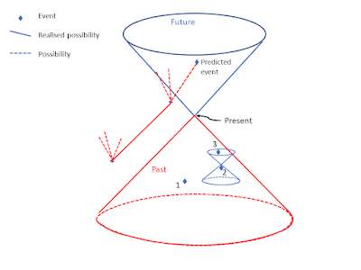

# The Impossibility of Prediction and Quantum Indeterminacy {#sec-Prediction_indeterminacy_and_randomness} 

The previous post introduced the ETH (Events, Trees and Histories) approach to the foundations and completion of quantum theory. This post addresses why it is impossible to use a physical theory to predict the future and why quantum mechanics is probabilistic although the Schrödinger equation is deterministic.

Prediction uses available information to get knowledge about what will happen. It is an epistemic concept. The impossibility of prediction does not mean that the world is not deterministic, not governed by probabilistic law or even not governed by any laws at all. However, if we could predict the future reliably then this would be evidence that the world is deterministic. We will examine Fröhlich's [-@frohlich2021relativistic] arguments.

## Impossibility of Prediction

It is always possible for someone to make a series of successful guesses about the future but what we are considering here is prediction based on available information and physical theory. To predict an event, we must know of everything that can affect that event. That is what the event is and when and where it takes place. Fröhlich's [1] argument is simple and illustrated by the diagram below.

The diagram uses the standard light-cone representation of space-time. The Future is at the top and the Past at the bottom. The predictor sits at the Present and has in principle access to all information in their Past light-cone. That is, they can access information on all past events but no information on what happens outside their Past light-cone. 

There is causal structure within the Past light-cone. Events 1 and 2 are space-like separated. They cannot influence each other. Event 3 is in the future of 2, so event 2 can influence 3. Of significance for the argument are the events outside the predictor's light-cones (Future and Past) that are in the past light-cone of the predicted event. These events can influence what happens at the space-time point of the predicted event, but the predictor can have no knowledge of them. Therefore, the predictor cannot predict in principle what will happen at a future space-time point. In practice it is common knowledge that prediction is seen to work in many situations. These situations are controlled to isolate the predicted phenomenon from the influence outside the predictor's control.

## Indeterminacy of Quantum Mechanics

The impossibility of reliable prediction does not imply indeterminacy.

Consider an isolated system. That is, over a period of time its evolution is independent of the rest of the universe. It is only for isolated physical systems that we know how to describe the time evolution of operators representing physical quantities in the Heisenberg picture (in terms of the unitary propagation of the system). 

In the Heisenberg picture states of $S$ are given by density matrices, $
ho$, acting on a separable Hilbert space, $\mathcal{H}$, of pure state vectors of $S$ as in the mathematical formulation presented previously. Let $\hat{X}$ be a physical property of $S$, and let $X(t) = X(t)^*$ be the self-adjoint linear operator on $\mathcal{H}$ representing $\hat{X}$ at time $t$. Then the operators $X(t)$ and $X(t')$ representing $\hat{X}$ at two different times $t$ and $t'$, respectively, are related by a unitary transformation:

$$X(t) = U(t', t) X(t') U(t,t')$$

where, for each pair of times $t, t'$, $U(t, t')$ is the propagator (from $t'$ to $t$) of the system $S$, which is a unitary operator acting on $\mathcal{H}$, and $\{U(t,t')\}_{t,t' \in \mathbb{R}}$ satisfy

$$U(t, t') \cdot U(t', t'') = U(t, t''), \quad \forall  t, t', t''$$
$$U(t, t) = 1, \quad \forall t$$

However, in the Copenhagen interpretation, whenever a measurement is made, at some time $t$, say the deterministic unitary evolution of the state of $S$ in the Schrödinger picture is interrupted, and the state collapses into an eigenspace of the self-adjoint operator representing the physical quantity that is measured and over that eigenspace the probabilities are given by Born’s Rule. This is what we have previously called the selection of a $\sigma$-algebra from the $\sigma$-complex of $S$.

As I am working towards a formulation of quantum mechanics that does not give a special status to measurement or observers. In the post *Modal categories and quantum chance* Born's rule is invoked as follows:

> The probability measure describes a contingent mode of being for the quantum system with a spectrum of values that are possible and become actual. What is missing is an understanding of the timing of the actualisation. In all the versions of quantum theory considered so far time behaves the same way as in classical physics.

While the question of timing is still to be resolved, quantum mechanics should be a theory that incorporates random events that are not derived from the deterministic evolution of the state. However, that evolution does govern the probabilities of becoming actual of property values associated with the spectrum of the self-adjoint operators representing the physical properties of $S$. 

It should be noted that Bohmian mechanics provides an alternative model in which the uncertainty of the outcome is due to uncertainty in the initial conditions for the dynamical evolution. In the Bohmian theory the uncertainty is epistemic, and the dynamics is deterministic. The Bohmian theory needs to introduce this uncertainty into an otherwise deterministic theory to obtain empirical equivalence to standard quantum mechanics.

The formulation of the quantum mechanics presented in this blog is, so far, consistent with the ETH approach [1]. Some aspects of special relativity have now been introduced even though a relativistic formulation of quantum mechanics has not been presented yet. This will be part of the formulation of a mathematical description of the quantum "event".