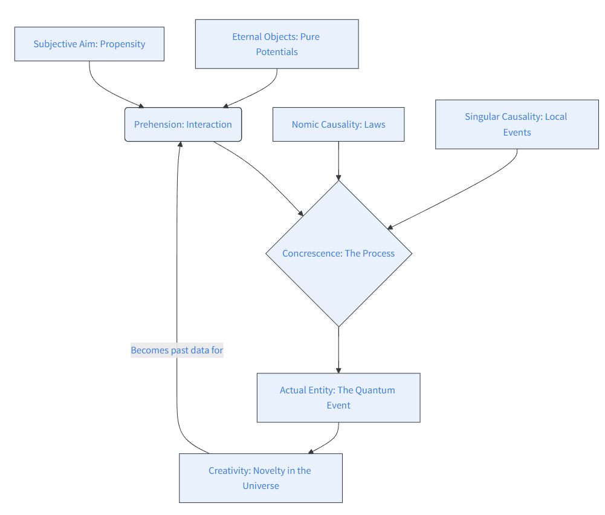

# Process ontology {#sec-Taking_Process_Philosophy_Seriously}

## The Philosophical Landscape — Physical Layer 

It was in *Taking Heisenberg’s Potentia Seriously* [@kastner2018] that I first encountered Ruth Kastner's **Relativistic Transactional Interpretation (RTI)**. Michael Epperson, one of the co-authors, has written his own book [@epperson2004] on quantum mechanics that makes extensive use of the concept of potentiality. This draws heavily on Whitehead's **Process Philosophy** but does not provide new physics, relying instead on a decoherence narrative used by many others. That narrative is not sufficient.

Kastner's transactions offer some novel physics in the relativistic formulation, involving an "offer and response" process. In addition, there is an interplay between **space-time events** and the quantum substratum *potentia*. Whitehead's process philosophy (which he misleadingly called a "philosophy of organism") may provide, or may be adapted to provide, a coherent cosmology encompassing quantum processes and events, but the physics of events still needs to be formulated.

## Alternative Mechanisms

The Relativistic Transactional Interpretation is not the only approach to providing a mechanism for quantum state reduction—leading to events—that is not *ad hoc*. The **"Events, Trees, and Histories" (ETH)** theory, as developed by Jürg Fröhlich and collaborators, also provides a mechanism. As with RTI, their approach requires interaction with massless modes (e.g., photons); however, retro-causality is not invoked.

The key concept in ETH is the **"Principle of Diminishing Potentialities."** This could be interpreted as adding what is missing from Kochen's reformulation of QM, but that is not a point that they make. To provide a rounded understanding of a physics that includes potentiality and processes leading to events, a cosmology is needed—an all-encompassing philosophical scheme.

## The Whiteheadian Scheme

An all-encompassing philosophical scheme that includes events and processes at the microscopic, mesoscopic, and macroscopic scales can only be speculative, but speculation should not be arbitrary. Following @whitehead2010:

> "...the philosophical scheme should be coherent, logical, and, in respect to its interpretation, applicable and adequate. Here 'applicable' means that some items of experience are thus interpretable, and 'adequate' means that there are no items incapable of such interpretation.
> 'Coherence,' as here employed, means that the fundamental ideas, in terms of which the scheme is developed, presuppose each other so that in isolation they are meaningless...
> The term 'logical' has its ordinary meaning, including 'logical' consistency, or lack of contradiction, the definition of constructs in logical terms, the exemplification of general logical notions in specific instances, and the principles of inference."

## Key Terms in Process and Reality

| Technical Term | Explanation | Relevance to Quantum Physics |
| --- | --- | --- |
| **Actual Entity / Occasion** | The fundamental unit of reality; a single, concrete event or experience. | Quantum events or interactions. Each event is a discrete occurrence. |
| **Prehension** | The process by which an actual entity "grasps" or is influenced by other entities. | Particles interacting through fundamental forces; influencing one another's states. |
| **Eternal Object** | Abstract entities or pure potentials (similar to Platonic forms) that actual entities can realize. | Properties like position or momentum. Represented by self-adjoint operators, **not** the wavefunction. |
| **Process** | Reality as dynamic "becoming" rather than static "being." | The flux of particles and fields governed by probabilistic laws. |
| **Creativity** | The ultimate principle representing the continuous creation of new actual entities. | Inherent unpredictability and novelty; related to creation operators in QFT. |
| **Singular Causality** | Specific, individual causes contributing to a single event. | Specific interactions leading to the collapse of a quantum state. |
| **Nomic Causality** | General or universal causes (scientific laws). | General laws like the Heisenberg equation ($i\hbar \frac{d}{dt}A = [A, H]$). |
| **Organism** | The interconnected, interdependent nature of reality. | The holistic view of systems where the whole is more than the sum of its parts. |
| **Concrescence** | The process of an entity coming into being by integrating many prehensions. | How states evolve and integrate influences to result in a specific event. |
| **Subjective Aim** | The inherent goal or purpose an entity strives for in its "becoming." | Propensity theory; how an outcome is selected from a probability distribution. |

### Flow diagram of key terms

