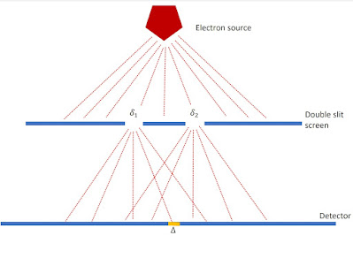
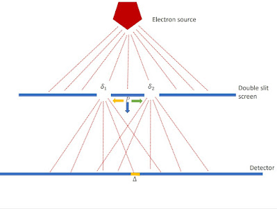

# The double slit experiment {#sec-The_double_slit_experiment}

Having discussed the issues with quantum measurement in general, and shown that standard interpretation of quantum mechanics is incomplete, Young's double slit experiment with electrons will be discussed in two variants (for background see Chapter 1 of @hall2013):
The standard configuration, to be described below, Figure (1).
A configuration with a pointer that acts behind the slits to point in the direction of the passing electron, Figure (2). 

## Standard configuration

The experiment, Figure (1), is as follows:

There is a source of electrons that move towards a screen with two slits.  
The intensity of the beam is low and only one electron is moving towards the detector at any time.  
The slits are marked $\delta_1$ and $\delta_2$.  
$\Delta$ be some arbitrary region on the electron detector.  

Let $Y_1$ and $Y_2$ be the projection operators for position in the regions of the two slits $\delta_1$ and $\delta_2$. Then $Y_1 + Y_2$ is the projection of position for the union $\delta_1 \cup \delta_2$. Let $X$ be the operator for position in a local region $\Delta$ on the detection screen. Assume the electron is only constrained to pass through the slits without being constrained as to which, then under those conditions the conditional probability is given by the Law of Alternatives:

$$
p(X|Y_1 + Y_2) = p(X|Y_1)p(Y_1|Y_1 + Y_2) + p(X|Y_2)p(Y_2|Y_1 + Y_2) 
$$
$$
\quad + \frac{\mathrm{tr}(Y_1 \rho Y_2 X)+\mathrm{tr}(Y_2 \rho Y_1 X)}{\mathrm{tr}(\rho (Y_1+ Y_2))}.
$$

This can be written more compactly as

$$
p(X|Y_1 + Y_2) = p(X|Y_1)p(Y_1|Y_1 + Y_2) 
$$
$$
\quad + p(X|Y_2)p(Y_2|Y_1 + Y_2) + p(X|Y_1+Y_2)_I
$$

where $p(X|Y_1+Y_2)_I$ is the interference term.

Note that if $X$ commutes with either $Y_1$ or $Y_2$, this interference term vanishes, because $Y_i Y_j = 0$ for $i \ne j$. This can be observed if the detector is right next to the two-slit screen because $X$ then coincides with either $Y_1$ or $Y_2$. If the detector is a distance from the two-slit screen (e.g. $X=\Delta$), then the state of the electron evolves unitarily via $\alpha_t$, so $\alpha_t(Y_i)=u_t Y_i u^{-1}_t$ no longer commutes with $\alpha(X)$, giving rise to the non-zero interference term.

The standard explanation of the interference effect is that the state of the particle is, or acts as, a coherent pair of waves emanating from the slits, which exhibit constructive and destructive interference effects. This was, of course, the explanation for Young's original experiment with light. For individual quantum particles, however, there is the unexplained local event observed at the detection screen. This is a problem for the theory. While the Born interpretation of the wavefunction provides a probability distribution for the particle position it requires the detection screen, operating outside what is described by the mathematical theory, to act as a sampling mechanism for that distribution.

The explanation given in this blog is that the two-slit screen functions as a preparation of the state for the particle, by which the state is conditioned, or reduced, to pass through the region $\delta_1\cup\delta_2$. This reduction is not a position measurement, since $\delta_1\cup\delta_2$ is not a localised region (as it would be for a single-slit screen). Once the particle reaches a detection screen then, in interaction with the screen, it appears in a random local region $\Delta$ and its position takes a value. Just as in the standard Born interpretation of the wavefunction, it is not explained in the theory how the electron takes the value that the detector detects other than invoking random sampling of the possible values.

So, the interference pattern on the detector is built up over time as more electrons arrive and are sampled by the detector.

## The introduction of an interaction with a pointer

This section is adapted from @bricmont2017, Appendix 5.A and @maudlin2019.

The experiment, illustrated in Figure (2), is now as follows:

There is again a source of electrons that move towards a screen with two slits.  
The intensity of the beam is low and only one electron is moving towards the detector at any time.  
The slits are marked $\delta_1$ and $\delta_2$.  
$\Delta$ be some arbitrary region on the electron detector.  

A pointer $P$ is introduced. It is a quantum object with three states: neutral $P_0$, points to slit $1$ ($P_1$), and points to slit $2$ ($P_2$). The interaction with the electron causes the pointer to move towards it.

Again let $Y_1$ and $Y_2$ be the projection operators for position in the regions of the two slits $\delta_1$ and $\delta_2$. Then $Y_1 + Y_2$ is the projection of position for the union $\delta_1 \cup \delta_2$. Let $X$ be the operator for position in a local region $\Delta$ on the detection screen. The operator representing the pointer has three eigenstates and therefore a three-dimensional Hilbert space $\mathcal{H}_P$. Without the pointer the Hilbert space is $\mathcal{H}_0$. The Hilbert space of the total system is $\mathcal{H}_P \otimes \mathcal{H}_0$.

The possible constituent states are:

- $\phi_1$ pointer pointing to slit $\delta_1$  
- $\phi_2$ pointer pointing to slit $\delta_2$  
- $\phi_0$ pointer neutral  
- $\psi_1$ electron through slit $\delta_1$  
- $\psi_2$ electron through slit $\delta_2$  
- $\Psi_0$ electron with pointer in neutral state $P_0$

Assuming the pointer starts in its neutral state, the initial wave function is

$$
\Psi_0 = \phi_0 \otimes (\psi_1 + \psi_2) $$ 
$$
= \phi_0 \otimes \psi_1 + \phi_0 \otimes \psi_2
$$

---

### Treatment I: Pointer reacts to which slit the electron passes through

Time evolution gives:

$$
\Psi = \phi_1 \otimes \psi_1 + \phi_2 \otimes \psi_2.
$$

The interference term becomes:

$$
p(X|Y_1+Y_2)_I = \frac{\mathrm{tr}(Y_1 \rho_\Psi Y_2 X)+\mathrm{tr}(Y_2 \rho_\Psi Y_1 X)}{\mathrm{tr}(\rho_\Psi (Y_1+Y_2))}
$$

Using orthogonality of pointer states:

$$
p(X|Y_1+Y_2)_I = 0
$$

Interference disappears.

---

### Treatment II: Pointer does *not* react to which slit the electron passes through

General evolution:

$$
\Psi = \sum_{i\in\{0,1,2\}} a_i \phi_i \otimes \psi_1
      + \sum_{i\in\{0,1,2\}} b_i \phi_i \otimes \psi_2
$$

with

$$
a_0=b_0,\quad a_1=b_2,\quad a_2=b_1.
$$

The detection pattern is:

$$
(\Psi, P\otimes X\,\Psi)
= \sum_i |a_i|^2 (\psi_1, X\psi_1)$$
$$
+ \sum_i |a_i|^2 (\psi_2, X\psi_2)
+ \sum_i a_1^* a_2 (\psi_2, X\psi_1)
+ \sum_i a_2^* a_1 (\psi_1, X\psi_2)
$$

Let $C=\sum_i |a_i|^2$:

$$
(\Psi, P\otimes X\,\Psi)
= C\big[(\psi_1,X\psi_1)+(\psi_2,X\psi_2)\big]
+ \mathrm{Re}\{2 a_1^* a_2 (\psi_2, X\psi_1)\}.
$$

Interference persists.

