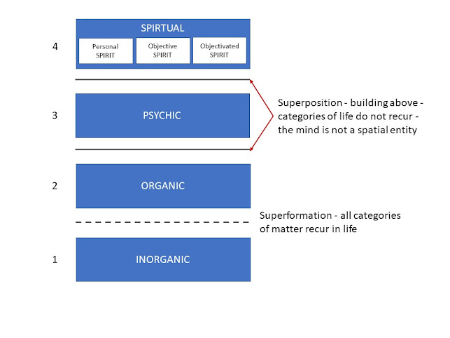

<!---
format:
  html:
    number-sections: true
    number-offset: 5 
--->
\pagenumbering{arabic}
\setcounter{page}{1}

# Critical ontology and layers of reality  {#sec-Why_critical_ontology}

**"Das Sein des Seienden ist indifferent gegen das, was das Seiende 'für jemanden' ist."** [@hartmann1948] \index{Hartmann, Nicolai}

*"The 'being' of things is indifferent to whatever things might be 'for someone'."*

Nicolai Hartmann asked "How is a critical ontology at all possible?" [@hartmann1924]. He was writing at a time when metaphysics was under attack or being dismissed as irrelevant. Part of his answer was that ontology, properly structured, is more like a science of what exists than speculative metaphysics. Critical ontology is a way of investigating what exists and how it exists. The investigation of being must be considered before turning to how things behave. Hartmann's writings on ontology [@hartmann1948], [@hartmann1937], [@hartmann1939], [@hartmann1949a] developed this answer further. In addition to taking seriously the phenomena of normal life and natural science, he examined in detail the history of ontology. Hartmann's critical historical examination, ranging from the pre-socratics to his contemporaries such as Heidegger, leads him to classify many approaches as mistaken in not addressing existence as such but merely the appearance or knowledge of things. He also argued that assigning all entities to either the realm of ideas or physical substance is a fundamental mistake.

> **Aside:** *Critical ontology* \index{ontology, critical} is a phrase used elsewhere in philosophy studies [@Richardson2023-RICCSO-2], but in a different sense to that used here. For example, as the branch of philosophy that studies social ontology in order to critique specific ideologies or "end" to *social injustice*. This has given rise to critical studies in the social sciences and underpins identity politics that then itself tends to become ideological. The use of "critical" in the set of investigations presented here has nothing to do with critical studies or critical theory or any of its ideological derivatives. "Critical" in these investigations means a stance or approach that examines theories, claims and proposals for consistency and correspondence with the facts together with a recognition that there is always the possibility of error. This comprehensively fallibilist stance should apply to all invesitigations but will be explicitly recognised in this one.

In addition to critical historical investigation, ontology needs ideas, terminology and structure. Hartmann's concepts of *heterogeneous ontic spheres* and *layers*, introduced above provide a starting point for this set of investigations but they will not escape critique either. \index{ontic sphere} \index{strata} \index{sphere} \index{entity} \index{object} \index{thing}

## Entities, spheres and layers

The phrase of Hartmann's *What is as such* will be taken as the point of departure for these investigations. It will be seen that there are many ways of being and the way things are depends on other things and the way they are. It is time to introduce some terminology. 

The term "entity" will be used for *what is*. An entity - purely as such, whatever it may be in its particulars - exists indifferently to whether it is known or not known; whether it is knowable or unknowable. Without entities there would be nothing to have properties, to make appearances nor to induce perceptions. 

The "object" is related to the entity and is used when the entity stands in relation to another entity. That is, it becomes an object through relationship with other objects.

The philosophical task of organising what exists into categories can be traced back to Aristotle, at least, and 'object' is a candidate for the category under which everything falls but so, perhaps, is "thing" or "entity". Nominal definitions can only provide an arbitrary distinction between the terms and so do not provide progress. Rather than just formally fixing technical definitions, use will be made of intuition from normal usage. This normal usage will provide guidance on the distinctions to be introduced above:

- "Entity" will be used to designate that which exists as such. *Entities will have their own particular way of being.*
- "Thing" can designate a physical entity. *Contrary to some physicalist ontologies not all entities are things.*
- An "object" is an entity that has properties, and these properties appear in relation to other entities.

In physical theories the entities of interest will be things that are objects. As we will see in our discussion of quantum physics, what makes an object physical will require development of the concept. Already it may seem that objects and things are the entities of interest and society can dispense with discussion of featureless entities. What is gained by insisting on the investigation of "entities" is the recognition that existence is not merely a matter of appearance.
 
Appearance only provides access to the object. This notion of appearance is interactional and reflexive. In particular, considering candidate things, quantum particles such as electrons, protons and positrons are objects and it is through their properties that they interact with other objects, and it is their properties that are observables in the sense of *standard quantum mechanics*. However, there are aspects to them being *things* that will mean extending the concept of physical from things in space and time.

The ontological structures introduced by Hartmann include:

- The ideal sphere of being
- The real sphere of being
- The layered structure of real being.
- The Dasein and Sosein relationship.

\index{Dasein} \index{Sosein}\index{real being}

A major purpose of Hartmann's ontology is to clarify the mistakes and pitfalls in both idealism and realism. These two "isms" make the dogmatic claim that fundamentally everything is either immaterial (Ideal) \index{Ideal} or everything physical (Real). \index{Real} Taking a critical ontology approach makes clear that there is no need to follow either dogmatic path but claims it is wrong to identify the real with the material. The real sphere is much larger.

The ideal sphere includes entities such a logic, mathematics, scientific theories. It is also the sphere where ethical and aesthetic values reside. The ideal and real spheres are not separate forms of existence but different ways of being. This is a position going back to Plato who argued that ideal being is superior to material being and more real because eternal. In contrast Hartmann argues that the real (as set out below) is the ontological stronger sphere. The two spheres are distinguished in that everything real is individual, unique, destructible; whereas everything ideal is universal, returnable, always existing.

The real sphere consists of the natural world of common experience and its elaboration through scientific investigation. This sphere has four layers or strata (Schichten): inorganic, organic, psychic, and spiritual. \index{ontology}

- **Inorganic stratum**, with categories such as space, time, process, substance, is organised through causality.
- **Organic stratum**, with categories such as metabolism, assimilation, self-regulation, self-reproduction and adaptation, is organically organised - the peculiarity of the organic network is unrecognizable for the time being.
- **Psychic stratum**, with categories such as consciousness, pleasure, act and content. Equally unknown is the form of determination of mental acts. That is, currently, we do not understand how mind works.
- **Spiritual stratum**, that includes categories of fear, hope, will, freedom, thought, personality, but also society, historicity, or intersubjectivity. Its organisation principle is, according to Hartmann, Finality [@hartmann1949b, page 58]. In this layer and in the psychic we are all players and this changes what a method of scientific exploration of being is going to be. The work of Hayek will provide a starting point for such deliberations [@Hayek1952SensoryOrder]

>**Note:** *Spirit* is employed here in the sense of the German term *Geist* that originates from the German idealist tradition influenced by Hegel among others. However it is also used in standard German. For example, in Geisteswissenschaft (Humanities)—and its meaning covers both individual mind as well as superindividual culture, which is why it lacks an adequate English translation. It need not be interpreted in any religious sense here. In addition, "psychic" relates to mind and mental - no interpretation in terms of occult "psychic phenomena" is intended.

In the stratified structure the organic layer builds on the inorganic and the psychic builds on the organic. It is only through the system of categories that apply to them that distinguish the levels. The relationship between the layers and their categories requires systemic treatment and will be covered in a separate section (@sec-layers).

## "Dasein" and "Sosein"

"Dasein" and "Sosein" ("being there" and "being so" although the original German will be used in the following translation) are interacting ways of being in both spheres. This is illustrated by a quotation from  @hartmann1948 page 123:

>Das Dasein des Baumes an seiner Stelle "ist" selbst ein Sosein des Waldes, der Wald wäre anders ohne ihn; das Dasein des Astes am Baum "ist" ein Sosein des Baumes; das Dasein des Blattes am Aste "ist" ein Sosein des Astes; das Dasein der Rippe im Blatt "ist" ein Sosein des Blattes. Diese Reihe läßt sich nach beiden Seiten verlängern; immer ist das Dasein des einen zugleich Sosein des anderen. Aber sie läßt sich auch umkehren: das Sosein des Blattes "ist" das Dasein der Rippe, das Sosein des Astes ist das Dasein des Blattes usf. Daß es immer nur ein Bruchstück des Soseins ist, das im Dasein von etwas anderem besteht, daran wird man hierbei keinen Anstoß nehmen dürfen. Denn es handelt sich gar nicht um die Vollständigkeit des Soseins. Wohl aber läßt sich sagen, daß auch die übrigen Bruchstücke des Soseins auf dieselbe Weise im Dasein von immer wieder anderem und anderem bestehen.

### Translation

>The Dasein of the tree in its place "is" itself a Sosein of the forest, the forest would be different without it; the Dasein of the branch on the tree "is" a Sosein of the tree; the Dasein of the leaf on the branch "is" a Sosein of the branch; the Dasein of the rib in the leaf "is" a Sosein of the leaf. This series can be extended to both sides; always the Dasein of one is at the same time Sosein of the other. But it can also be reversed: the Sosein of the leaf "is" the Dasein of the rib, the Sosein of the branch is the Dasein of the leaf, etc. That it is always only a fragment of the Soseins, which consists in the Dasein of something else, must not be taken negatively. Because it is not at all about the completeness of being. But it can be said that the other fragments of Sosein also exist in the repeating existence of always different and different things.

## Critical ontology

For the purpose of these investigations Hartmann's work provides not just a philosophical system but a way of investigating *being* systematically. It is critically constructive and can be adopted as a way of proceeding without agreeing with Hartmann's specific conclusions.

Through step by step investigation we can gain greater insight into the constituents of the world. In these investigations topics will be tackled in physical and social science as well as philosophy where ambiguity over what exists or dogmatic positions risk hiding the nature of what there is and how it acts. For example, in physics, the status of space and time has been debated for millennia. Some claim that one or the other or both are illusory. In economics *homo economicus* is often declared not to exist but can be found implicitly and explicitly in many textbooks.

It is the current debate on the foundations of quantum mechanics on the status of the wavefunction and the particle that rekindled my interest in ontological questions. So quantum physics will have a number of chapters devoted to it and be referred to throughout these investigations.

Hartmann's philosophy will provide the initial structure for theses ontological investigations. A very useful and concise introduction to Hartmann's philosophy as whole is provided by Predrag Cicovacki in The Analysis of Wonder [@cicovacki2014].

##  Layers of being {#sec-layers} 
\index{Layers of being}

To discuss ontology in general and to compare competing ontological proposals some structure is useful. This structure will help to place *candidate beings* in relation to others, understand their way of being and, for example, avoid the category mistake of identifying elements of physical reality with their mathematical representation.  Here we will explore, in general terms, the proposal that reality is indeed stratified and secondly what that stratification may be. In *critical ontology* it will be important to distinguish whether these levels are levels of reality *per se* or levels in a description of reality. 

The starting point cannot just be comprehensive scepticism about whether anything exists or not. That will get us nowhere. We will start by taking the phenomena around us as the they appear. There appear to be things that take up space and are static. There appear to be things that take space and grow. There appear to be things that have some purpose and make choices. There appear to be things that are made up of other things.   In addition, there appear to be beings with emotional states and awareness of making choices. There is also awareness of resistance or pushback from other things. There is awareness of being the capacity of some beings to change the state of other things. We may be mistaken about particular things and their relationship to each other but the appearances are the appearances.  In talking about things and beings, we have implicitly used categories such a space, time, choice, emotion, awareness and substance. The categories will play an important role is characterising the levels in which beings exist. There will be separate chapter on categories.

Hartmann proposes a pluralistic view of reality, that covers all the things and beings listed above, that appear in four dynamically interrelated strata or layers (@sec-Why_critical_ontology and @cicovacki2014):

1. Inorganic 
2. Organic 
3. Psychic 
4. Spiritual. 

The layers are presented in the order of decreasing ontological strength. That is, in each layer the beings depend on those in stronger layers to exist. However, the beings in the less strong layers cannot be reduced to beings in stronger layers. They have their specific categories of existence. There are also multi strata beings as will be illustrated at the end of this chapter. The question of whether these levels exist and the nature of their existence will not be examined here other than to recognise them as structural proposals and so will be seen to at least exist at the *spiritual level*, as part of an ontological theory.

The name given to each level is not problematic in English except for the fourth.  *Spiritual being* is a translation from the German *geistige Sein* and the use of the term *Geist* follows the tradition influenced by Hegel and Dilthey - as it is used, for example, in Geisteswissenschaft,and its meaning covers both individual mind as well as superindividual culture, which is why it lacks an adequate English translation. No religious sense of the term is intended here. Beings at the spiritual level cannot exist without the lower levels in this ontology. 

Although the listing of the four strata suggests a hierarchy, to provide this thought with some substance something needs to be said about the relationship between the strata. The levels of reality are characterised (and therefore distinguished) by their categories. With regard to the levels of reality, it is obvious that the categories in question are ontological rather than epistemological. There are categories that pertain to reality as whole - such as time, whole, part. At the inorganic level the categories of physics are different from those of chemistry. Some examples follow.

1. Inorganic stratum, with categories such as space, time, process, substance, is organised through causality.

2. Organic stratum, with categories such as metabolism, assimilation, self-regulation, self-reproduction and adaptation, is organically organised - the details of the organising principles are unknown for the time being.

3. The psychic stratum, with categories such as consciousness, pleasure, act and content, has its own psychic network of relations. Equally unknown is the inner essence of the form of determination of mental acts.

4. Spirit includes categories of fear, hope, will, freedom, thought, personality, but also society, historicity, or intersubjectivity. It is organised as three modes of spirit;

    - Personal - thought, freedom, conscious action and moral will

    - Objective - superindividual but living as culture, collective or society

    - Objectivated - superindividually existing but non-living. As in cultural artifacts and institutions.

All categories at the inorganic level, such as space and time, recur at the organic level.  This recurrence of categories is called *superinformation*. There is also autonomy off levels and this is known as *superposition* - building above. For example, *consciousness*, a category of the psyche, is not spatial itself, although it will depend on a physical infrastructure.

Hartmann’s categories are polar, correlative, and non‑reducible. That is, each pair expresses two moments of being that are mutually dependent yet ontologically distinct. They are not contradictions but are tensions built into the structure of reality. The catagory pairs are: 

1. Principle – Concretum

- Principle: the universal, law‑like, general aspect of being.
- Concretum: the individual, determinate, fully actualised entity.

>Every concretum embodies principles; principles exist only through concreta. Universality and individuality are inseparable.

2. Structure – Modus

- Structure: the stable, ordered pattern or configuration of a being.
- Modus: the variable, contingent way in which that structure is realised.

>Structure is invariant; modus is its concrete manifestation. A being’s structure persists through changing modi.

3. Form – Matter

- Form: the organising, delimiting, shaping aspect.
- Matter: the indeterminate substrate capable of receiving form.

> Form actualises matter; matter individuates form. This is a universal ontological relation, not merely Aristotelian.

4. Inner – Outer
- Inner: intrinsic, essential, non‑relational aspects.
- Outer: relational, expressive, externally oriented aspects.

>The inner grounds the outer; the outer manifests the inner. Being has both an inward essence and outward expression.

5. Determination – Dependence

- Determination: what a being is in itself — its qualities, powers, limits.
- Dependence: what a being requires from others to be what it is.

>Determinations imply dependencies; dependencies shape determinations. No being is self‑sufficient.

6. Quality – Quantity

- Quality: the “what‑ness” — character, nature, kind.
- Quantity: the “how‑much” — magnitude, number, degree.

>Qualities are intensified or diminished through quantities; quantities are meaningful only relative to qualities.

7. Unity – Manifoldness

- Unity: coherence, wholeness, integration.
- Manifoldness: plurality of parts, aspects, or moments.

>Unity integrates manifoldness; manifoldness articulates unity. Every whole is a structured multiplicity.

8. Harmony – Conflict

- Harmony: ordered, mutually supportive relations.
- Conflict: tension, opposition, struggle.

>Harmony presupposes resolved conflict; conflict presupposes differentiated elements capable of harmony. Reality is dynamic, not static.

9. Contrast – Dimension

- Contrast: difference, polarity, opposition.
- Dimension: the continuum or field within which contrasts occur.

>Contrasts articulate dimensions; dimensions provide the space for contrasts. Being is structured by fields of possible variation.

10. Discretion – Continuity
- Discretion: separateness, discreteness, distinctness.
- Continuity: connectedness, gradation, seamlessness.

>Discrete elements exist within continuous fields; continuity is structured by discrete nodes. Reality is neither purely discrete nor purely continuous.

11. Substratum – Relation

- Substratum: the underlying bearer of properties.
- Relation: the connections that situate the substratum within a network.

>Substrata are always in relations; relations presuppose relata. Being is both self‑standing and interconnected.

12. Element – Structure

- Element: basic constituent unit.
- Structure: ordered whole composed of elements.

>Elements gain identity through structure; structure exists only through elements. This is the fundamental category of compositional ontology.

The above only provides a sketch. For more detail on the categories of real being see @cicovacki2014 who provides a bridge to the detailed work by Hartmann.

The basic structure can be summarised in a diagram.

Hartmann's model of reality includes mind and spirit superposed on an ontologically stronger foundation of life and matter. There is, however,  a feedback loop that is not explicit in the diagram. The objectivated spirit gives rise to artifacts, such as books and architecture, that are also actualised as things at the material level. 

For example, this content of this investitgation exists as objectivated spirit. It came into being because of my choice and was enabled by the infrastructure supplied by the web. Making and maintaining the documentation are choices made by me at the level of my personal spirit. The physical document is dependent on organised matter (inorganic level) the organisation of it is objectivated spirit because it was designed. The document and its chapters are captured and encoded in the infrastructure. The chapters may be instantiated on the screen of a reader's device. The readers use their sense organs and brain (organic level) to access the information that is processed through their psychic level and, hopefully, understood at the level of their personal spirit.  The readers and I form a loose community that exists as objective spirit.

Simple beings such as electrons may only inhabit the inorganic level but the existence of complex beings may be across many or all strata. This complex existence is a process rather than a hierarchy.

