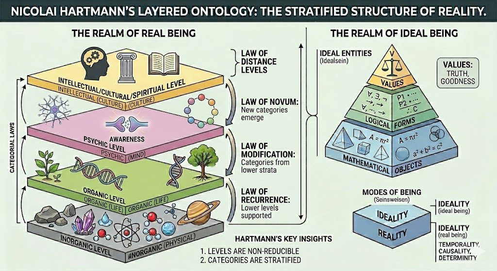
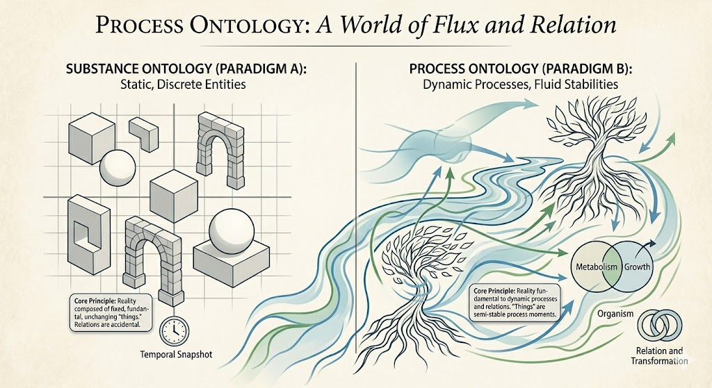
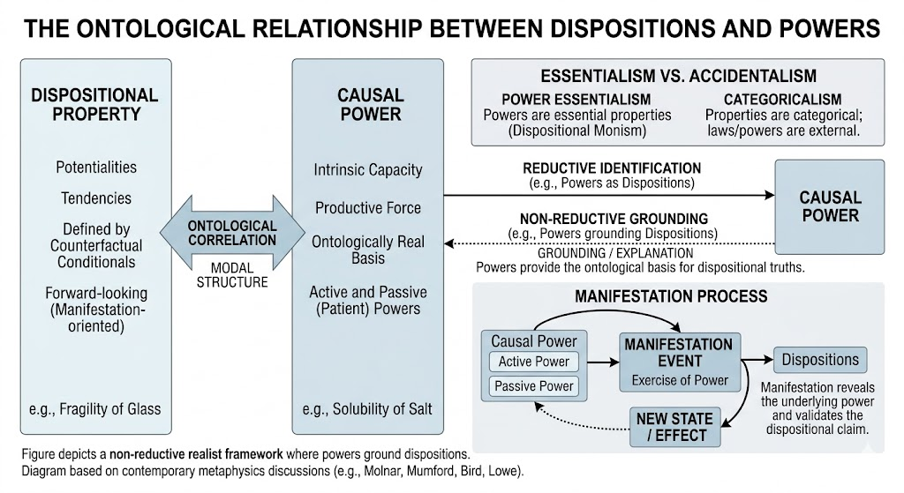
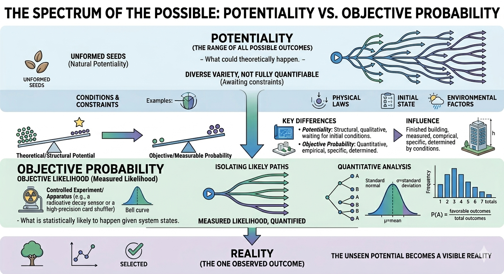
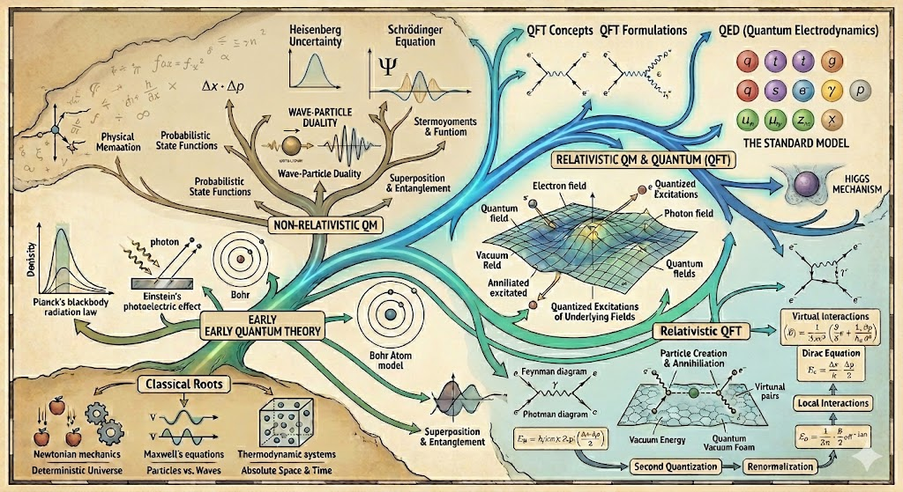

# Overview {.unnumbered}

\pagenumbering{roman}
\setcounter{page}{1}

These investigations will be organised in sections and chapters. The structure is that of an online book that is a work in progress.

<!-- *The assistance of Gemini is acknowledged for the illustrations and formatting.* -->

## Foundations {.unnumbered}

This part of the book will consider the ontological and analytical foundations  to enable the disccuion on the physical, organic, psychic and spiritual levels of reality. 

### Layered ontology {.unnumbered}

In the body of work that set out in his Critical Ontology , Nicolai Hartmann proposed a layered ontology for the Real Sphere. 

A layer ontology provides a framework for understanding the different levels of reality and the entities that inhabit them. The layers are not strictly hierarchical, but they do provide a way to organize our understanding of the world. Their exact ontological status is a matter of debate, but they provide a useful framework for understanding the different levels of reality and the entities that inhabit them. The layers are not strictly hierarchical, but they do provide a way to organize our understanding of the world. 

<!--  -->

- @sec-Why_critical_ontology
- @sec-field-of-sense
<!--  -->

<!-- ### Fields of Sense {.unnumbered} -->

<!-- - [Objects in a Field of Sense](Objects-in-a-Field-of-Sense.qmd) -->

### Process ontology {.unnumbered}

A process ontology provides a framework for understanding the dynamic and evolving nature of reality. It emphasizes the importance of processes and events in shaping the world around us. The key figure in developing suchan approach is Alfred North @whitehead2010 , who developed a process philosophy that has been influential in many areas of thought.

<!--  -->

- @sec-Taking_Process_Philosophy_Seriously

### Dispositions and powers {.unnumbered}

An important issue with a world populated by entities is the question of how they interact with each other. The notion of dispositions and powers provides a framework for understanding the causal relationships between entities. Dispositions are properties that an entity has that can be manifested under certain conditions, while powers are the abilities of an entity to bring about certain effects in the world.

<!--  -->

- @sec-The-ontology-of-dispositions

### Probability and potentiality {.unnumbered}

Potentaility is intimately related to disposition. The notion of potentiality provides a framework for understanding the possibilities that exist in the world, while probability provides a way to quantify the strength tendency of those possibilities to come into being. The relationship between potentiality and probability is an important area of investigation in the philosophy of science and metaphysics.

<!--  -->

- @sec-potentiality-and-probability

### Complex systems {.unnumbered}

- @sec-ontology-of-complex-systems

## Physical level {.unnumbered}

The physical or inorganic level of reality is the foundation for all other levels. It is the level of matter and energy, and it is governed by the laws of physics. The physical level provides the basis for understanding the entities and processes that inhabit the world around us. THe sdiscuusion will will emphasis the ontological challengesd in the quantum domain, and the relationship between the quantum substratum and the empirical domain. 

### Physics {.unnumbered}

<!--  -->

- @sec-A_Relational_Reconstruction_of_Quantum_Mechanics
- @sec-Heisenberg_Potentiality_and_Quantum_Ontology
- @sec-The_double_slit_experiment
- @sec-Locality_and_quantum_mechanics
<!-- - @sec-Bell-and-locality -->
- @sec-BellsTheorem
- @sec-Comparison-of-quantum-physical-ontologies
- @sec-heart-of-matter
- @sec-Quantum_objects
- @sec-The_combination_of_quantum_objects
- @sec-Quantum-chance
- @sec-quantum_modal_ontology
- @sec-Events_Histories_and_Trees
- @sec-Prediction_indeterminacy_and_randomness
- @sec-Events_in_quantum_mechanics

### Chemistry {.unnumbered}

## Organic level {.unnumbered}

The Organic Layer is the level of life and living organisms. It is the level of biology, and it is governed by the laws of biology. The organic level provides the basis for understanding the entities and processes that inhabit the world around us. The discussion will emphasis the ontological challenges in the biological domain, especially the relationships leading to natural selection and genetics.

- @sec-selection
- @sec-genetics

## Psychic level {.unnumbered}

The Psychic Layer is the level of consciousness and mental processes. It is the level of psychology, and it is governed by the laws of psychology. The psychic level provides the basis for understanding the entities and processes that inhabit the world around us. The discussion will emphasis the ontological challenges in the psychological domain, especially the relationships leading to consciousness and cognition.

- @sec-Hartmann-Hayek-ontology
- @sec-sensory-order

##  Spiritual level {.unnumbered}

The entites at the Spiritual Layer are bodies of thought, institutions, organizations, and social structures. It is the level of social interaction and creativity, and that is governed by the laws of sociology. It is also the level at which the individual acts. The spiritual level provides the basis for understanding the entities and processes that inhabit the world around us. The discussion will emphasis the ontological challenges in the spiritual domain, especially the relationships leading to institutions and culture.

### Government {.unnumbered}

- @sec-ontological-critiques-of-the-notion-of-government
- @sec-libertarian-foundations
- @sec-the-liberal-order
- @sec-hartmann-and-hayek
    

### Economics {.unnumbered}

- @sec-economic-entities

### The arts {.unnumbered}

### Sciences {.unnumbered}

### Mathematics and Logic {.unnumbered}

## Synthesis

The Realm of Real Being is a complex and multi-layered reality. The different levels of reality are interconnected and interdependent, and they provide a rich and diverse landscape for understanding the world around us. The synthesis of the different levels of reality provides a comprehensive framework for understanding the entities and processes that inhabit the world around us. In addition the discussion will focus on how it nourishes and is nourished in turn by the the Realm of Ideal Being. 