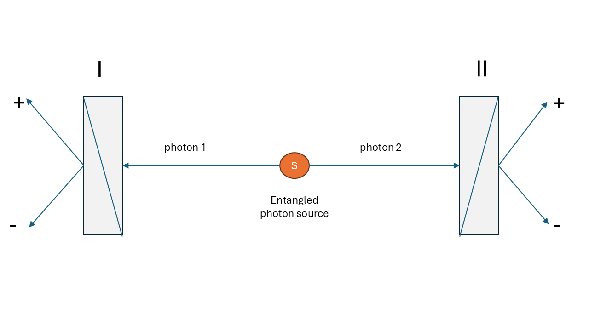
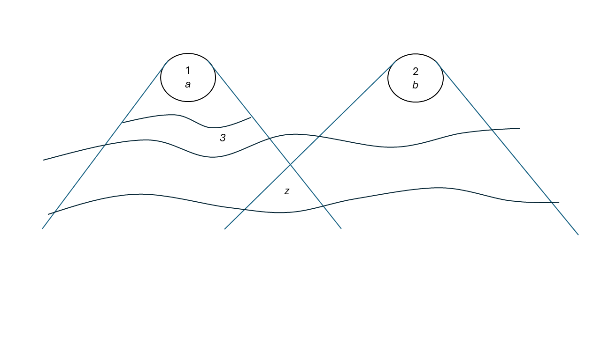

# Bell’s Theorem {#sec-BellsTheorem}

Bell’s theorem has an untidy history. It is even debatable whether it merits being called a theorem. However, it is extremely important, as we show below, and we endeavour to shape it into the form of a theorem.

We present the proof in two parts, as in @MyrvoldGenoveseShimony2020:

- formulate a measurement framework and then derive a version of the inequality;
- demonstrate that quantum mechanics predicts violations of the inequality.

This will show a conflict between a statistical analysis of possible experiments that assumes a locality concept that we call Bell locality (BL), and textbook quantum mechanics (QM). Further discussion is then devoted to the challenge of deciding experimentally between BL and QM.

The framework is a generalisation of the one used in @Bell1964. Bell’s 1964 derivation assumed an experiment involving perfect anticorrelation of the results of aligned Stern-Gerlach experiments on a pair of entangled spin-$\frac{1}{2}$ particles. This is not realistic, and experimental tests need this assumption to be relaxed because of the practical difficulties of maintaining quantum coherence and guaranteeing spacelike separation of the measurements. An experimental setup with polarised photons is more appropriate. Papers that took the steps from Bell’s 1964 demonstration to an experimentally testable form include @CHSH1969, @Bell1971, @ClauserHorne1974, @Aspect1983 and @Mermin1986.

The initial part of the proof will use a framework describing the general experimental setup and the assumptions sufficient to ensure satisfaction of the Bell inequalities. The second part will show that quantum mechanics predicts violations of the inequalities. The conceptual framework postulates an ensemble of configurations of two correlated subsystems, with each entangled system labelled 1 and 2. Each entangled system is characterised by a configuration state $z$ that contains the entirety of its properties, including the properties of the individual sub-systems and any correlations between them. The state $z$ is taken to be a complete specification of the properties of the configuration at the moment of generation and future evolution, other than future experimental decisions.

The state space $Z$ is the totality of all states $z$, and we assume that the subsets of $Z$ are measurable subsets, forming a measurable space to which probabilistic considerations may be applied. The probability distribution over $Z$ is denoted by $\rho$. In addition, it is assumed that the mode of generation of the pairs establishes a probability distribution $\pi$ that is independent of the histories of each of the two systems after they separate. Temporal evolution of the properties of the two systems after separation is possible, but it is assumed that the state $z$ sets the probabilities for subsequent events (including any temporal evolution), and therefore the probabilities for outcomes of experiments to be performed on the sub-systems separately.

Different experiments may be performed on each subsystem. We use $a \in \mathcal{A}$ as variables ranging over possible experiment settings $\mathcal{A}$ on subsystem 1, and $b \in \mathcal{B}$ as variables ranging over experiment settings $\mathcal{B}$ on subsystem 2. It is not assumed that these parameters capture the complete state of the experimental apparatus, which might have a range of microstates corresponding to each experimental setting; consider them as labels. The following assumption concerns experimental procedures and the independence of the preparation of the entangled system from the choice of experiments to be performed.

> **Measurement Independence Assumption**: the preparation probability distribution $\rho$ is independent of the processes by which the choice of experiments to be performed is made.

The results of an experiment with setting $a$ on subsystem 1 are labelled by a real parameter $s$, taking values from a discrete set $S_a$ of real numbers in the interval $[-1,1]$. Equivalently, the result of an experiment on subsystem 2 is labelled by a parameter $\tau$, taking values from a discrete set $T_b$ in $[-1,1]$. The sets of possible outcomes depend on the choice of experimental settings. The restriction of the outcome labels to the interval $[-1,1]$ is a choice made only for convenience. It is essentially a measurement calibration, and it is important that the calibration be consistent across all experiments. The restriction to discrete outcome sets is not essential, but it is convenient for the proof of the Bell inequalities.

We assume that, for each pair of settings $a,b$, and every $z \in Z$, there is a probability function $\pi_{a,b}(s,\tau \mid z)$, which obviously sums to unity over all $s \in S_a$ and $\tau \in T_b$. We can use these probabilities to define marginal probabilities:

$$ \pi^1_{a,b}(s \mid z) \equiv \sum_{\tau \in T_b} \pi_{a,b}(s,\tau \mid z), $${#eq-1a}

$$ \pi^2_{a,b}(\tau \mid z) \equiv \sum_{s \in S_a} \pi_{a,b}(s,\tau \mid z), $${#eq-1b}

Define $A_z(a,b)$ and $B_z(a,b)$ as the expectation values, for complete state $z$, of the outcomes of experiments on subsystems 1 and 2, respectively, when the settings are $a,b$.

$$A_z(a,b) \equiv \sum_{s \in S_a} s \, \pi^1_{a,b}(s \mid z)$${#eq-2a}

$$B_z(a,b) \equiv \sum_{\tau \in T_b} \tau \, \pi^2_{a,b}(\tau \mid z)$${#eq-2b}

Now define the expectation value of the product $s \cdot \tau$ of outcomes:

$$E_z(a,b) \equiv \sum_{s \in S_a,\, \tau \in T_b} (s \cdot \tau)\,\pi_{a,b}(s,\tau\mid z).$${#eq-3}

Bell-type inequalities follow from considerations of locality and causality that have been called *factorisability* or *Bell locality* (BL). This is formulated as the following factorisation condition on the response probability distribution of outcomes, conditional on the complete state $z$ of the configuration.

(BL) For any $a,b,z$, there exist probability functions $\pi^1_a(s \mid z)$ and $\pi^2_b(\tau \mid z)$ such that

$$
\pi_{a,b}(s,\tau \mid z) = \pi^1_a(s \mid z)\,\pi^2_b(\tau \mid z).
$$

Note that, even though the probability factors into independent subsystem-1 and subsystem-2 probabilities conditional on the total system state $z$, the outcome in subsystem 1 does not depend on the setting of the experiment in subsystem 2, and vice versa. The condition (BL) is a consequence of the conjunction of two conditions, which have been called *parameter independence* and *outcome independence* (see @sec-CausAssu, below).

If the factorisability condition (BL) is satisfied, then $A_z(a,b)=A_z(a)$ and $B_z(a,b)=B_z(b)$, so

$$E_z(a,b) = A_z(a) B_z(b).$${#eq-4}

The above definitions are valid for experiments with any number of discrete outcomes. The simplest case is that in which each experiment has only two distinct outcomes, which we may label by $\pm 1$.

To derive the inequalities, at least two separate experimental settings per subsystem must be considered, $a,a',b,b'$. Now consider the quantities

$$S_z(a,a',b,b') = \lvert E_z(a,b) + E_z(a,b') \rvert + \lvert E_z(a',b) - E_z(a',b') \rvert.$${#eq-5}

We now introduce a quantity related to $S_z(a,a',b,b')$, namely $S_\rho$, where the expectation values in @eq-5 are averaged over $\rho$, the distribution over states $z \in Z$.

$$ S_\rho(a,a',b,b') = \lvert\langle E_z(a,b) \rangle_\rho + \langle E_z(a,b') \rangle_\rho\rvert + \lvert\langle E_z(a',b) \rangle_\rho - \langle E_z(a',b') \rangle_\rho\rvert. $${#eq-6}

Note that, in taking the expectation values of the quantities appearing on the right-hand side of this definition with respect to the same distribution $\rho$, we are invoking the Measurement Independence Assumption. Under this assumption and the BL condition, we shall prove the following:

**Bell’s theorem — part 1**: For $S_\rho(a,a',b,b')$ given by @eq-6, the following inequality holds:

$$\tag{BT1} S_\rho(a,a',b,b') \leq 2.$$ 

This is due to @ClauserHorneShimonyHolt1969 and is known as the *CHSH (Clauser–Horne–Shimony–Holt) inequality*.

**Proof**

From @eq-5, we have

$$ \langle S_z(a,a',b,b') \rangle_\rho = \langle \lvert E_z(a,b) + E_z(a,b') \rvert \rangle_\rho + \langle \lvert E_z(a',b) - E_z(a',b') \rvert \rangle_\rho. $$

Since the absolute value of the average of any random variable cannot be greater than the average of its absolute value, it is clear that

$$S_\rho(a,a',b,b') \leq \langle S_z(a,a',b,b') \rangle_\rho.$${#eq-7}

If BL is satisfied, then, using @eq-3 and the fact that $A_z(a)$ and $A_z(a')$ lie in the interval $[-1,1]$,

$$ S_z(a,a',b,b') $${#eq-9}

$$= \lvert A_z(a)(B_z(b) + B_z(b'))\rvert + \lvert A_z(a')(B_z(b) - B_z(b'))\rvert$$

$$\leq \lvert B_z(b) + B_z(b') \rvert + \lvert B_z(b) - B_z(b')\rvert. $$

It is easy to check that

$$\lvert B_z(b) + B_z(b') \rvert + \lvert B_z(b) - B_z(b') \rvert = 2\max(\lvert B_z(b) \rvert,\,\lvert B_z(b')\rvert).$$

Since $B_z(b)$ and $B_z(b')$ also lie in the interval $[-1,1]$, from the previous step we conclude that, for every $z$,

$$S_z(a,a',b,b') \leq 2.$${#eq-11}

Since this bound holds for every value of $z$, it must also hold for the expectation value of $S_z$.

$$\langle S_z(a,a',b,b')\rangle_\rho \leq 2.$${#eq-12}

This, together with @eq-7, yields the CHSH inequality and completes the proof of BT1. $\square$

The final step of the proof of our Bell theorem is to show that a system described by a quantum mechanical state violates BT1, the CHSH inequality.

**Bell’s theorem — part 2**: There is a quantum mechanical state and a set of experiments for which the CHSH inequality is violated.

$$\tag{BT2} \langle S_z(a,a',b,b')\rangle_\rho \nleq 2.$$ 

The set of experiments used to test the CHSH inequality will be referred to as CHSH experiments. Here, we consider one example involving polarisation-entangled photons, @fig-1.

Consider a pair of photons 1 and 2 propagating in the $\zeta$-direction. Let $\ket{\chi}$ and $\ket{\upsilon}$ represent states in which photon $j$ ($j=1,2$) is linearly polarised in the $\chi$- and $\upsilon$-directions, respectively. Neglecting the part of the state that describes movement in the $\zeta$-direction, consider the following part of the state vector that describes the polarisation of the photons:

$$\ket{\Phi} = \frac{1}{\sqrt{2}}\left(\ket{\chi}_1 \ket{\chi}_2 + \ket{\upsilon}_1 \ket{\upsilon}_2 \right),$${#eq-15}

which is invariant under rotation of the $\chi$ and $\upsilon$ axes in the plane perpendicular to $\zeta$. The total quantum state of the pair of photons 1 and 2 is invariant under exchange of the two photons, as required by the fact that photons are integral-spin particles. Suppose now that photons 1 and 2 impinge respectively on the faces of birefringent crystal polarisation analyzers I and II, with the entrance face of each analyzer perpendicular to $\zeta$. Each analyzer has the property of separating light incident upon its face into two outgoing non-parallel rays, the *ordinary ray* and the *extraordinary ray*. The transmission axis of the analyzer is a direction with the property that a photon polarised along it will emerge in the ordinary ray (with certainty if the crystals are assumed to be ideal), while a photon polarised in a direction perpendicular to $\zeta$ and to the transmission axis will emerge in the extraordinary ray. See @fig-1 for a schematic of the experimental setup.

{#fig-1}

Photon pairs are emitted from the source, each pair quantum mechanically described by $\ket{\Phi}$ of @eq-15. I and II are polarisation analyzers, with outcomes $s=1$ and $\tau=1$ designating emergence in the ordinary ray, while $s=-1$ and $\tau=-1$ designate emergence in the extraordinary ray. The crystals are also idealised by assuming that no incident photon is absorbed.

The expectation value, in state $\ket{\Phi}$, of the product of $s$ and $\tau$, is

$$E_{\Phi}(\mathbf{a}, \mathbf{b}) =\cos^2 (\theta_{\mathbf{a} \mathbf{b}}) - \sin^2 (\theta_{\mathbf{a} \mathbf{b}})$${#eq-16}

$$= \cos(2\theta_{\mathbf{a} \mathbf{b}}).$$

The details are calculated in @sec-CHSH-app, below.

Here $\theta_{\mathbf{a} \mathbf{b}} = \alpha-\beta$ is the angle between the transmission axes of the two analyzers. The expectation value $E_{\Phi}(\mathbf{a}, \mathbf{b})$ is a correlation function, and it is a function of the angle between the transmission axes of the two analyzers. The correlation function is maximal when the transmission axes are aligned, and minimal when they are perpendicular.

An important insight of Bell’s was that it is important to consider the less-than-perfect correlations obtained when the device axes are not aligned. Bell’s theorem shows that no model satisfying the condition BL can reproduce the quantum correlations for all angles. This can be seen by considering the quantum predictions (@eq-15, @eq-16) and plugging them into the expression for $S$. For the case of polarisation-entangled photons, we have

$$S_{\Phi}(\phi) = \lvert 2 \cos(2\phi)\rvert + \lvert \cos(2\phi) - \cos(6\phi) \rvert.$${#eq-20}

This takes on its maximum at $\phi = {\pi}/{8}$.

$$S_{\Phi}({\pi}/{8}) = 2\sqrt{2} \approx 2.828.$${#eq-21}

## Locality and causality assumptions {#sec-CausAssu}

The key condition giving rise to the Bell inequality (BT1) is the factorisability condition (BL). This condition is motivated by considerations of locality and causality. It is also a purely mathematical relationship between probabilities. For the proof, it is only necessary to find one system described by a quantum state and a set of experiments for which the CHSH inequality is violated. However, for experimental tests it is important to understand the physical assumptions that motivate the condition (BL) and ensure that these are met. In this section we discuss these assumptions.

### Bell’s Principle of Local Causality

Bell’s Principle of Local Causality has evolved since the publication of @Bell1964. We will not be concerned with the details of this evolution, but rather with the core idea that the result of a measurement on one system be independent of the setting of a distant measurement, provided the two measurements were not coordinated in their joint past.

In his final contribution (@Bell_Aspect_2004), Bell derives the factorisability condition (BL) from the *Principle of Local Causality*. He bases his analysis on the following:

- relativity prohibits superluminal causation;
- the cause-effect relation is asymmetric in time, with causes temporally preceding their effects;
- in a relativistic spacetime, events at spacelike separation are taken to have no temporal order.

Bell’s final statement of the Principle of Local Causality is as follows (see @fig-2):

> **Principle of Local Causality** (PLC): A theory will be said to be locally causal if the probabilities attached to values of local beables in a spacetime region 1 are unaltered by specification of values of local beables in a spacelike separated region 2, when what happens in the backward light cone of 1 is already sufficiently specified, for example by a full specification of local beables in a spacetime region 3.

{#fig-2}

Bell’s term *beable* means any element of a physical theory that is taken to correspond to something physically real; therefore a beable is an entity in the Real Sphere as described in (@sec-Why_critical_ontology), and *local beables* pertaining to a spacetime region are those contained within that region. The term was, of course, introduced to generalise beyond the term *observable* in textbook QM.

Note that the preparation state $z$ is a complete specification of the properties of the entangled system at the moment of generation, and hence is in the backward light cone of both region 1 and region 2.

The formulation of the local causality condition is motivated by @Bell1976 with the remark,

> Now my intuitive notion of local causality is that events in **spacetime region 2** should not be “causes” of events in **spacelike separated region 1**, and vice versa. But this does not mean that the two sets of events should be uncorrelated, for they could have common causes in the overlap of their backward light cones.

The system state $z$ is a common cause of correlations between the two subsystems. Correlations between two variables that are not in a cause-effect relation to each other can be explained by some common cause.

Bell then proceeds to formulate the condition of local causality, which is that a full specification of beables in the overlap of the backward light cones of the spacetime regions 1 and 2 should screen off correlations between them. Implicit in this is that correlations between two variables be susceptible to causal explanation, either via a causal connection between the variables, or via a common cause.

The Principle of Local Causality follows from the conjunction of three assumptions, all of which were explicitly formulated by Bell:

- (Temporal Asymmetry of Causality) Any cause of an event lies in its temporal past, and not in its temporal future.
- (Lorentz Invariance) The relation of temporal precedence is invariant under Lorentz boosts.
- Common cause.

### Parameter independence and outcome independence

The condition BL of factorisability is the application, to the particular setup of CHSH experiments, of Bell’s Principle of Local Causality. As we have seen, it can be thought of as the conjunction of the condition of causal locality and the common-cause principle. In this subsection we apply those conditions to the setup of CHSH experiments.

On the assumption that the experimental settings can be treated as free variables, whose choice of setting on one wing is made at spacelike separation from the experiment on the other, a dependence of the probability of the outcome of one experiment on the setting of the other would seem straightforwardly to be an instance of a nonlocal causal influence. The condition that this not occur can be formulated as follows.

(PI) For all parameter settings $a$, $a'$, $b$, $b'$, all $z$, and all $s \in S_a$ and $\tau \in T_b$,

$$\pi^1_{a,b}(s \mid z) = \pi^1_{a,b'}(s \mid z);$${#eq-22a}

$$\pi^2_{a,b}(\tau \mid z) = \pi^2_{a',b}(\tau \mid z).$${#eq-22b}

This is the condition that has come to be known as *parameter independence*, following @Shimony1986, @Shimony1990).

For fixed values of the experimental settings, Bell’s Principle of Local Causality entails that the outcomes of the experiments on the two systems be independent, conditional on the specification $z$ of the complete state of the system at the source. This is the *outcome independence* condition.

(OI) For each pair of parameter settings $a,b$, and all $z$, and all $s \in S_a$ and $\tau \in T_b$,

$$\pi_{a,b}(s,\tau \mid z) = \pi^1_{a,b}(s \mid z)\; \pi^2_{a,b}(\tau \mid z).$${#eq-23}

A violation of PI would seem to permit superluminal signalling, but this requires an additional assumption: that the state of the system be controllable. It would not hold for a theory on which there are principled limitations on the ability of would-be signallers to control the states of the systems they are dealing with; an example of a theory of this sort is Bohmian mechanics, which violates PI but does not permit superluminal signalling. In some of the literature, PI has incorrectly been treated as equivalent to no-signalling.

### Explicit experimental assumptions {#sec-SuppAssu}

#### Unique experimental outcomes

Of the potential outcomes of a given experiment, one and only one occurs, and hence it makes sense to speak of *the* outcome of an experiment. However, Everettian, or “many-worlds”, interpretations state that all potential outcomes actually occur. Even in these interpretations, though, each individual world has a unique outcome.

#### Experimental settings as free parameters

It is assumed that the complete state $z$ is always sampled from the same probability distribution $\rho$, no matter what choice of experiment is made, and that, for this reason, the subset of experiments corresponding to any given choice of settings is a fair sample of the distribution of $z$. This will be discussed in more detail in @sec-bell-metaphysics .

#### Timing of experimental outcomes

In experiments, care should be taken that, for the two subsystems, the choice of experimental setting and the registration of results take place at spacelike separation. It is assumed that experiments have unique results. The question arises as to *when* the unique result emerges. It is typically assumed that the result is definite once a detector has been triggered or the result has been recorded in a computer memory. This difficulty will remain unresolved until the quantum mechanical measurement problem is solved.

## Appendix: quantum mechanical calculation of the CHSH inequality {#sec-CHSH-app}

We will calculate the joint measurement probabilities of two entangled photons, find their correlation function, and show how it perfectly violates the limits of classical physics.

### 1. The initial entangled state

In an optical setup using spontaneous parametric down-conversion (SPDC), a pair of photons are generated and sent to measurement equipment $A$ and $B$ in a maximally entangled polarisation state described by the symmetric Bell state, @eq-15:

$$\ket{\Phi} = \frac{1}{\sqrt{2}} \left( \ket{\chi}_1 \ket{\chi}_2 + \ket{\upsilon}_1 \ket{\upsilon}_2 \right)$$

Here, $\ket{\chi}$ and $\ket{\upsilon}$ represent horizontal and vertical linear polarisations. This state means that if settings $a$ at $A$ and $b$ at $B$ both measure in the $\chi$ or $\upsilon$ direction, they will always get identical results (either both $\chi$ or both $\upsilon$).

### 2. The measurement bases

Settings $a$ and $b$ can be independently rotated.

- the **$a$** setting of polariser I is the angle $\alpha$;
- the **$b$** setting of polariser II is the angle $\beta$.

A polariser at angle $\theta$ measures whether a photon is polarised along that angle ($+1$ result) or perpendicular to it ($-1$ result). We can write these measurement states as:

$$\ket{+\theta} = \cos\theta \ket{\chi} + \sin\theta \ket{\upsilon}$$

$$\ket{-\theta} = -\sin\theta \ket{\chi} + \cos\theta \ket{\upsilon}$$

### 3. Calculating joint probabilities

We require the probability that the settings $a$ and $b$ both detect a photon passing through their polarisers ($+1,+1$). According to Born’s rule, this is the squared magnitude of the inner product of the measurement state and the initial state:

$$\pi_{++}(\alpha, \beta) = |\langle +\alpha, +\beta \mid \Phi \rangle|^2$$

First, let us find the inner product:

$$\langle+\alpha, +\beta \vert{} \Phi\rangle = \frac{1}{\sqrt{2}} \left( \langle \chi\vert{} \cos\alpha + \langle \upsilon\vert{} \sin\alpha \right)_1 \otimes \left( \langle \chi\vert{} \cos\beta + \langle \upsilon\vert{} \sin\beta \right)_2 \left( \vert{}\chi_1,\chi_2\rangle + \vert{}\upsilon_1,\upsilon_2\rangle \right)$$

Because $\langle \chi\vert{}\chi\rangle = 1$ and $\langle \chi\vert{}\upsilon\rangle = 0$, this simplifies to:

$$\langle+\alpha, +\beta \vert{} \Phi\rangle = \frac{1}{\sqrt{2}} (\cos\alpha \cos\beta + \sin\alpha \sin\beta)$$

Using the trigonometric identity $\cos(\alpha - \beta) = \cos\alpha \cos\beta + \sin\alpha \sin\beta$,

$$\langle+\alpha, +\beta \vert{} \Phi\rangle = \frac{1}{\sqrt{2}} \cos(\alpha - \beta)$$

Squaring this gives the joint probability of both getting $+1$:

$$\pi_{++}(\alpha, \beta) = \frac{1}{2} \cos^2(\alpha - \beta)$$

By doing the same for the other combinations (for example, using $\vert{}-\alpha\rangle$ or $\vert{}-\beta\rangle$), we obtain the full set of joint probabilities:

- *$\pi_{++}$* (both pass): $\frac{1}{2} \cos^2(\alpha - \beta)$
- *$\pi_{--}$* (both blocked): $\frac{1}{2} \cos^2(\alpha - \beta)$
- *$\pi_{+-}$* ($a$ passes, $b$ blocked): $\frac{1}{2} \sin^2(\alpha - \beta)$
- *$\pi_{-+}$* ($a$ blocked, $b$ passes): $\frac{1}{2} \sin^2(\alpha - \beta)$

### 4. The expectation value (correlation function)

The correlation function $E(\alpha, \beta)$ is the average product of their measurement outcomes. We weight the matching results ($+1 \times +1 = 1$ and $-1 \times -1 = 1$) positively, and the opposing results ($+1 \times -1 = -1$) negatively:

$$E(\alpha, \beta) = \pi_{++} + \pi_{--} - \pi_{+-} - \pi_{-+}$$

Substituting the probabilities just calculated:

$$E(\alpha, \beta) = \left( \frac{1}{2} \cos^2(\alpha - \beta) + \frac{1}{2} \cos^2(\alpha - \beta) \right) - \left( \frac{1}{2} \sin^2(\alpha - \beta) + \frac{1}{2} \sin^2(\alpha - \beta) \right)$$

$$E(\alpha, \beta) = \cos^2(\alpha - \beta) - \sin^2(\alpha - \beta)$$

Using the identity $\cos(2\theta) = \cos^2\theta - \sin^2\theta$, we arrive at the quantum correlation function:

$$E(\alpha, \beta) = \cos(2(\alpha - \beta))$$

This is exactly the result we stated in @eq-16, with $\alpha-\beta = \theta_{ab}$, confirming that the quantum mechanical predictions for the correlation function violate the CHSH inequality for certain choices of angles $\alpha$ and $\beta$.
