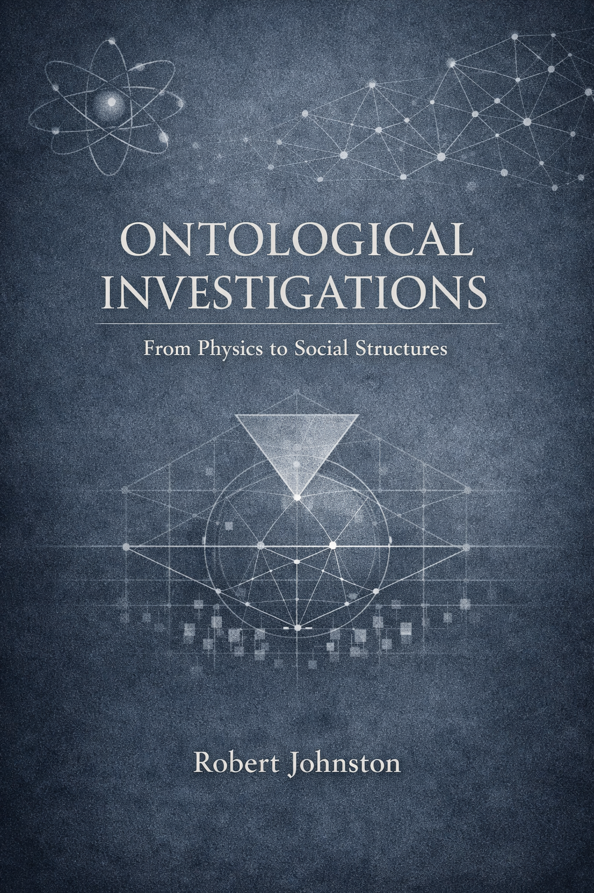

---
format:
  pdf: default
---

::: {.content-visible when-format="html"}

{width=100%}

:::


# Preface {.unnumbered}

*The “being” of things is indifferent to whatever things might be “for someone”.*  [@hartmann1948] \index{Hartmann, Nicolai}

The world as we find it is rich in things. This book will look at a series of ontological challenges and solutions ranging from physical foundations to societies, cultures and the entities that inhabit them. The book will focus on the ontological status of entities and their properties, and how they interact with each other. The book will also consider the ontological status of events, processes and relations.

*Entity* is the most general term that will be used to refer to things that exist. Entities can be physical, social, cultural, or mental. They can be concrete or abstract. They can be simple or complex. They can be individual or collective. They can be natural or artificial. They can be real, ideal or fictional. They can be actual or potential. They can be stable or dynamic. They can be independent or dependent. They can be autonomous or relational. The guiding principle in this book is that entities can have properties and interactions that are independent of whatever anyone or anything knows about them. For example,  experiments are for finding out about the physical world not for instantiating it. That is, the physical world is there even when no one is looking. The discussion will engage with ontologies that deal principally with an autonomous world that is independent of considerations of what is known about the entites or who is interacting with it. This is not to neglect aretifiacts. Artifacts have propoerties that aare consiquence of the intentions of their creator.

However, opposing views will also be considered in their strongest form. For example, there are quantum theories that focus on what can be known about a physical system rather than what the systems behaviour is *per se*. The original Copenhagen interpretation of quantum mechanics falls into this category, but a more recent approach is Quantum Bayesianism. Commonly shortened to *QBism* [@FuchsSchack2013], it interprets the quantum state as capturing a degree of belief. There are questions about the ontological assumptions associated with the theory, with options ranging from a form of idealism to "participatory realism". 

Karl Popper's three-world ontology [@Popper1972] is a useful framework for considering the ontological status of entities and their properties. The three worlds are:

1. The physical world of matter and energy, which is independent of human knowledge and perception.
2. The world of mental states and consciousness, which is dependent on human knowledge and perception.
3. The world of abstract objects and ideas, which is independent of human knowledge and perception.

This would have been my starting point if I had not discovered Nicolai Hartmann's *New Ontology* [@hartmann1949b], because it is rich enough to allow for the semi autonomy of mental staters and ideas. However, Hartmann's ontology is more general and more flexible than Popper's. It allows for a richer set of entities and properties, and it allows for a more nuanced understanding of the relationships between entities and their properties.

The ontological framework for this book is therefore taken from Nicolai Hartmann's *new ontology programme* [@hartmann1949b] that was developed in a number of very substantial publications in the first half of the 20th century. In my interpretation of it, it is the open and pluralistic nature of Hartmann's new ontology that is most attractive. It can include categories of substance, process, organism, consciousness and more. Its layer structure allows the discussion of emergence of multiple entities and supervenience, whatever the ultimate ontological status of the layer model. The openness and pluralism is more important to me than the layered ontology. However, many chapters are specifically about the challenges posed by quantum mechanics. Quantum mechanics was already making confirmed predictions when Hartmann was writing, and he provided some analysis, but, did not get much further than identifying that quantum mechanics would provide some ontological challenges. In Hartmann's layered ontological model the foundation for the *Real Sphere* is the inorganic stratum, with categories such as space, time, process and substance.


\newpage


```{=latex}
\tableofcontents
```

